# PIMS Architecture Review (Phase B)
## Dynamics / SAP Solution Architect Audit

| Document | Version | Status | Date |
|----------|---------|--------|------|
| ARCHITECTURE_REVIEW.md | 0.2.0 | Phase B Review Complete | 2026-08-02 |

**Reviewed baselines:** `PLAN.md` v0.1.1, `DATABASE.md` v0.1.1, `NAMING_CONVENTION.md` v0.1.1  
**Review stance:** Critical — treat Phase A as a strong draft, not production-ready MDM.

---

## 1. Executive Verdict

Phase A correctly established the **core packaging BOM → loading → scenario → shipment → statement** spine and the critical rule that **component owns weight**. That foundation is sound for disposable carton/pallet packaging of a single product style.

It is **not yet sufficient** for İnci Akü as an enterprise packaging MDM covering starter vs industrial batteries, container materials, returnables, pool packaging, immutable compliance evidence, ERP sync, or Power BI historical reporting.

**Recommendation:** Adopt the **Target Model (v0.2)** defined in this document before any Excel or Python build. Do not implement Phase A schema as-is.

| Area | Phase A Grade | Target v0.2 |
|------|---------------|-------------|
| Normalization (core BOM) | Strong | Keep |
| Weight ownership | Strong | Keep + freeze snapshots |
| Returnable / pool packaging | Weak | Redesign required |
| Container loading | Weak | Redesign required |
| Revision / audit immutability | Weak | Redesign required |
| PPWR extensibility | Moderate | Extension tables required |
| ERP / SQL / Power BI readiness | Moderate | Keys + fact grain required |
| Excel operability | Risk | Sheet partitioning + limits |

---

## 2. Problems Found

### 2.1 Missing Entities

| ID | Gap | Why it matters | Scenarios impacted |
|----|-----|----------------|--------------------|
| P-01 | No `PRODUCT_CATEGORY` / battery segment | Starter vs industrial have different pack patterns, DoC scope, and reporting cuts | 1, 2, 10, 11, 15 |
| P-02 | No `LEGAL_ENTITY` / company code | SAP Company Code / Dynamics Legal Entity owns DoC, economic operator identity, plant assignment | 7, 8, 9, 13, 14 |
| P-03 | No `LOAD_UNIT_TYPE` (pallet / container / truck / stillage) | `LOADING_CONFIG` is pallet-shaped (`UNITS_PER_LAYER`, `LAYERS_PER_LOAD`, `PALLET_COMPONENT_ID`) | 3, 10, 15 |
| P-04 | No container master / container loading materials model | Dunnage, airbags, desiccants, container liners, lashing are not first-class | 3, 6, 9 |
| P-05 | No `PACKAGING_OWNERSHIP_TYPE` / pool model | Cannot distinguish disposable vs returnable vs third-party pool | 4, 5, 6, 9 |
| P-06 | No `PACKAGING_POOL` / `POOL_OPERATOR` | CHEP/IPP-style pool accounts and asset classes missing | 5, 13, 15 |
| P-07 | No returnable asset / movement entity | `IS_REUSABLE` flag cannot model returns, cycles, losses, deposits | 4, 5, 6, 9 |
| P-08 | No `COMPONENT_MATERIAL_SHARE` | Single `MATERIAL_ID` fails multi-material / composite PPWR reporting | 6, 7, 9, 15 |
| P-09 | No structured substance table | SoC only as free-text notes on Technical File | 6, 7, 8 |
| P-10 | No shipment composition freeze table | Historical statements recalculate from live masters → audit drift | 6, 9, 12, 14, 15 |
| P-11 | No `STATEMENT_SHIPMENT` bridge | Cannot prove which shipments entered a statement | 9, 12, 13 |
| P-12 | No config revision / supersession entity | `VERSION_NO` on mutable header is not true revision control | 12, 7, 8, 9 |
| P-13 | No ERP external-key map | Only ad-hoc `EXTERNAL_REF` on shipment | 13, 14 |
| P-14 | No regulation / requirement catalog | Future PPWR articles cannot be attached without schema change | 6, 7, 8 |
| P-15 | Technical File cannot target Loading Config | Container/tertiary assessments orphaned | 3, 7 |
| P-16 | DoC ↔ Technical File is 1:N only | Real DoCs cite multiple evidence packs | 7, 8 |
| P-17 | No economic operator role | Manufacturer / importer / distributor not modeled | 6, 8, 13 |

### 2.2 Missing or Weak Relationships

| ID | Problem | Impact |
|----|---------|--------|
| R-01 | Shipment → Scenario only; no pin to packaging/loading **revision** | Config edits rewrite history |
| R-02 | Statement has no formal link to shipments | Non-reproducible compliance |
| R-03 | `PRODUCT_PACKAGING_ASSIGNMENT` dual nullable FKs (pkg and/or loading) | Ambiguous engineering default; hard to validate |
| R-04 | `COMMERCIAL_SCENARIO.CUSTOMER_ID` mandatory | Blocks stock, internal transfer, multi-distributor generic scenarios |
| R-05 | DoC scope is Product and/or Packaging Config only | Industrial kits / loading-level scope unsupported |
| R-06 | Pallet modeled as header FK instead of BOM line | Special-case relationship breaks uniform explosion |
| R-07 | No party→legal entity ownership | Multi-company İnci group reporting unclear |

### 2.3 Wrong or Incomplete Normalization

| ID | Issue | Severity | Correction |
|----|-------|----------|------------|
| N-01 | `PALLET_COMPONENT_ID` on `LOADING_CONFIG` | Medium | Move to `LOADING_CONFIG_LINE` with `LINE_ROLE = PALLET` |
| N-02 | `LKP_MATERIAL.MATERIAL_FAMILY` free text | Low | Promote to `LKP_MATERIAL_FAMILY` |
| N-03 | `PPWR_CATEGORY_CODE` free text on material | Medium | `LKP_PPWR_MATERIAL_CATEGORY` FK |
| N-04 | One `MATERIAL_ID` on `COMPONENT` | High | Header “primary material” optional; shares in child table |
| N-05 | Single overloaded `LKP_STATUS` for masters, shipments, approvals | Medium | Split status domains or add `STATUS_DOMAIN` |
| N-06 | `PERSON.ROLE_TITLE` free text | Low | Optional `LKP_PERSON_ROLE` |
| N-07 | `CURRENCY_ID` on scenario without commercial amount | Low | Keep only if pricing context needed; else remove from packaging core |
| N-08 | Statement line is frozen (good) but inputs are not | High | Add shipment packaging snapshot grain |

### 2.4 Naming Inconsistencies

| ID | Inconsistency | Target standard |
|----|---------------|-----------------|
| NM-01 | `PKG_CONFIG_LINE_ID` vs entity `PACKAGING_CONFIG_LINE` | `PACKAGING_CONFIG_LINE_ID` |
| NM-02 | `SCENARIO_ID` vs table `COMMERCIAL_SCENARIO` | `COMMERCIAL_SCENARIO_ID` |
| NM-03 | `DOC_ID` clashes semantically with `DOC_TYPE` / documents | `DECLARATION_OF_CONFORMITY_ID` |
| NM-04 | `DEST_COUNTRY_ID` vs `DESTINATION_COUNTRY_ID` | Always `DESTINATION_COUNTRY_ID` |
| NM-05 | `TECH_FILE_LINK_ID` vs `TECHNICAL_FILE_*` | `TECHNICAL_FILE_LINK_ID` |
| NM-06 | `VALID_FROM/TO` vs `EFFECTIVE_FROM/TO` | Masters/configs: `EFFECTIVE_*`; commercial validity may stay `VALID_*` but document the split |
| NM-07 | `DOC_TYPE` used for both tech attachments and DoC vocabulary | Rename attachment lookup to `LKP_EVIDENCE_TYPE` if DoC keeps “document” language |

### 2.5 PPWR Compliance Risks

| ID | Risk | Consequence |
|----|------|-------------|
| C-01 | No composite material breakdown | Incorrect material-category placed-on-market totals |
| C-02 | Recycled content only as % on component | Cannot store supplier declarations / evidence dates |
| C-03 | Reuse modeled as boolean | Returnable packaging obligations understated |
| C-04 | No packaging function (sales / grouped / transport) | Misclassification risk under PPWR packaging categories |
| C-05 | No empty-space / minimization attributes | Future design-for-minimization evidence missing |
| C-06 | Technical File mostly narrative fields | Weak structured conformity evidence for audits |
| C-07 | No statement lineage to shipments + composition freeze | Challenge from authority cannot be reconstructed |
| C-08 | No regulation article coverage matrix | Hard to prove “requirements assessed” |
| C-09 | Economic operator / legal entity absent | DoC signatory context incomplete |
| C-10 | Pool packaging invisible in statements | Risk of double-counting or omission of hired packaging |

### 2.6 Excel Implementation Risks

| ID | Risk | Mitigation |
|----|------|------------|
| E-01 | 35–50 sheets becomes unusable for business users | Split: `PIMS_Master`, `PIMS_Config`, `PIMS_Ops`, `PIMS_Compliance` with shared ID discipline |
| E-02 | No native FK engine | Mandatory validation dashboard + Phase D validator before go-live |
| E-03 | Explosion calc in worksheet formulas will not scale | Precompute `SHIPMENT_PACKAGING_LINE` (fact) on posting/approval |
| E-04 | Concurrent SharePoint edits corrupt keys | Single-writer SOP or Dataverse/SQL sooner for ops facts |
| E-05 | Integer ID collisions with multi-user entry | Block ID ranges per entity; later sequence service |
| E-06 | Power BI on live Excel masters rewrites history | BI reads snapshot facts, not live BOM only |
| E-07 | Wide COMPONENT sheet invites denormalized columns | Keep extension tables even in Excel |

### 2.7 Scalability / Performance / Integration Risks

| ID | Risk | Horizon |
|----|------|---------|
| S-01 | Shipment × BOM explosion without persisted fact table | Power BI & statements fail at volume |
| S-02 | Mutating `COMPONENT.WEIGHT_G` changes all historical calcs | Compliance incident |
| S-03 | No external natural keys for SAP MATNR / customer | Integration rework |
| S-04 | INT IDs may be fine; lack of GUID/alternate keys for sync | ERP merge conflicts |
| S-05 | Scenario-required customer blocks D2C / stock transfers | Process redesign later |
| S-06 | Loading model cannot express container hierarchy (unit→pallet→container) | Industrial / export growth blocked |

---

## 3. Scenario Coverage Assessment (Phase A vs Target)

| # | Future scenario | Phase A | Target v0.2 | Gap closed by |
|---|-----------------|---------|-------------|---------------|
| 1 | Starter Batteries | Partial via PRODUCT | Full | `PRODUCT_CATEGORY`, pack assignments |
| 2 | Industrial Batteries | Partial | Full | Category + multi-config + container loading |
| 3 | Container Loading Materials | Fail | Full | `LOAD_UNIT_TYPE`, container lines, materials |
| 4 | Returnable Packaging | Fail | Full | ownership type + asset movement |
| 5 | Pool Packaging | Fail | Full | pool operator/account + movements |
| 6 | Future PPWR requirements | Partial | Designed-in | regulation/requirement + extension tables |
| 7 | Technical File generation | Partial | Full | multi-subject + requirement coverage + freeze |
| 8 | Declaration of Conformity generation | Partial | Full | legal entity, M:N evidence, revision |
| 9 | Shipment Statement generation | Partial | Full | statement↔shipment + composition snapshot |
| 10 | Multiple packaging configs / product | Pass | Pass | keep assignment; add purpose |
| 11 | Multiple commercial scenarios / product | Pass | Pass | nullable customer; clearer uniqueness |
| 12 | Multiple revisions | Fail | Full | revision/supersession + pin on shipment |
| 13 | Future ERP integration | Partial | Full | `EXTERNAL_ID_MAP`, legal entity, plant codes |
| 14 | Future SQL migration | Pass (shape) | Pass+ | naming cleanup + fact tables |
| 15 | Future Power BI reporting | Partial | Full | star-schema facts + date/market dims |

---

## 4. Recommended Improvements

### 4.1 Design Principles (Enterprise)

1. **Master data is versioned; facts are immutable.**  
2. **Never recalculate approved compliance from live masters.**  
3. **Uniform BOM explosion** — no special-case pallet FK.  
4. **Party + Legal Entity pattern** (SAP Business Partner / Company Code thinking).  
5. **Extension tables over wide columns** for PPWR evolution.  
6. **External ID map** for every integratable entity.  
7. **Excel is a temporary RDBMS UI**, not the long-term system of record for high-volume shipments.

### 4.2 Structural Redesign (Must Adopt)

| Change | Action |
|--------|--------|
| Loading model | Generalize to `LOAD_UNIT_TYPE`; support pallet and container hierarchies |
| Pallet FK | Remove `PALLET_COMPONENT_ID`; use loading lines |
| Composite materials | Add `COMPONENT_MATERIAL_SHARE` |
| Revisions | Add revision headers or supersession chain; pin revision on shipment |
| Snapshot | Add `SHIPMENT_PACKAGING_LINE` (frozen explosion) |
| Statement lineage | Add `STATEMENT_SHIPMENT` |
| Returnables/pools | Add ownership type, pool, asset movement |
| Compliance docs | Multi-subject technical file; DoC↔TF M:N; legal entity |
| Naming | Align all PK names to full entity names |
| Status | Domain-aware statuses |
| ERP | `EXTERNAL_ID_MAP` + source system lookup |

### 4.3 Phased Introduction (Avoid Big-Bang Excel)

| Wave | Entities | Excel Phase |
|------|----------|-------------|
| Wave 1 | Core BOM + product category + load unit type + naming fixes + shipment snapshot + statement bridge | C (first workbook) |
| Wave 2 | Legal entity, external ID map, tech file/DoC hardening, regulation coverage | C/D |
| Wave 3 | Returnable assets, pool packaging, container hierarchy refinements | D/E |
| Wave 4 | Full SQL + Power BI star schema as system of record for facts | F |

Wave 1 is mandatory before any production data entry.

---

## 5. Final Entity List (Target Model v0.2)

### 5.1 System

| Entity | Purpose |
|--------|---------|
| `SYS_WORKBOOK_INFO` | Schema version, workbook metadata |
| `SYS_PARAMETER` | Allocation methods, defaults |
| `SYS_VALIDATION_LOG` | Rule execution log |
| `SYS_DATA_DICTIONARY` | Field catalog (optional sheet) |

### 5.2 Lookups

| Entity | Purpose |
|--------|---------|
| `LKP_STATUS` | Status values |
| `LKP_STATUS_DOMAIN` | MASTER / SHIPMENT / DOCUMENT / MOVEMENT |
| `LKP_UOM` | Units of measure |
| `LKP_PACKAGING_LEVEL` | Primary / Secondary / Tertiary (+ future levels if needed) |
| `LKP_PACKAGING_FUNCTION` | SALES / GROUPED / TRANSPORT |
| `LKP_COMPONENT_TYPE` | Carton, film, pallet, dunnage, container liner, etc. |
| `LKP_MATERIAL` | Material master (reporting grain) |
| `LKP_MATERIAL_FAMILY` | Polymer / paper / metal / wood / … |
| `LKP_PPWR_MATERIAL_CATEGORY` | Official/mapped PPWR category |
| `LKP_RECYCLABILITY_CLASS` | Recyclability class |
| `LKP_COUNTRY` | ISO countries + EU flag |
| `LKP_CURRENCY` | ISO currencies |
| `LKP_TRANSPORT_MODE` | Road/sea/air/rail/multi |
| `LKP_LOAD_UNIT_TYPE` | PIECE_PACK, PALLET, CONTAINER, TRUCK, STILLAGE |
| `LKP_OWNERSHIP_TYPE` | DISPOSABLE, COMPANY_RETURNABLE, CUSTOMER_RETURNABLE, POOL |
| `LKP_STATEMENT_TYPE` | Annual/quarterly/internal |
| `LKP_EVIDENCE_TYPE` | Tech file, test report, spec, certificate |
| `LKP_LINE_ROLE` | BASE, PALLET, WRAP, DUNNAGE, CORNER, LABEL, … |
| `LKP_INCOTERM` | Incoterms |
| `LKP_PRODUCT_CATEGORY` | STARTER_BATTERY, INDUSTRIAL_BATTERY, OTHER |
| `LKP_MOVEMENT_TYPE` | ISSUE, RETURN, LOSS, REPAIR, POOL_HIRE, POOL_RETURN |
| `LKP_SOURCE_SYSTEM` | PIMS, SAP, D365, MANUAL |
| `LKP_ECONOMIC_OPERATOR_ROLE` | MANUFACTURER, IMPORTER, DISTRIBUTOR, AUTHORIZED_REP |
| `LKP_ASSIGNMENT_PURPOSE` | DOMESTIC, EXPORT, OEM, SAMPLE, CONTAINERIZED |

### 5.3 Organization / Party

| Entity | Purpose |
|--------|---------|
| `LEGAL_ENTITY` | Company code / DoC issuer |
| `PERSON` | Users, approvers, signatories |
| `SUPPLIER` | Packaging suppliers |
| `CUSTOMER` | Sold-to / ship-to commercial party |
| `PLANT` | Shipping / producing plant |
| `POOL_OPERATOR` | Third-party pool provider |
| `PACKAGING_POOL` | Named pool / account / asset class |

### 5.4 Product & Packaging Masters

| Entity | Purpose |
|--------|---------|
| `PRODUCT_FAMILY` | Family grouping |
| `PRODUCT` | SKU; net product weight only |
| `COMPONENT` | Atomic packaging item; owns unit weight |
| `COMPONENT_MATERIAL_SHARE` | Multi-material composition % / mass share |
| `COMPONENT_SUBSTANCE` | Structured substances of concern (optional Wave 2) |
| `COMPONENT_RECYCLED_CONTENT` | Evidence-dated recycled content declarations (optional Wave 2) |

### 5.5 Configuration (Revision-Aware)

| Entity | Purpose |
|--------|---------|
| `PACKAGING_CONFIG` | Packed-unit BOM header (revisionable) |
| `PACKAGING_CONFIG_LINE` | Component qty per packed unit |
| `LOADING_CONFIG` | Load-unit assembly header (revisionable; pallet/container/…) |
| `LOADING_CONFIG_LINE` | Components per load unit (includes pallet/dunnage) |
| `LOADING_CONFIG_PARENT` | Optional hierarchy: child load unit inside parent (pallet in container) |
| `PRODUCT_PACKAGING_ASSIGNMENT` | Product ↔ packaging/loading validity + purpose |

**Revision rule:** Each config row is an immutable revision once `STATUS = ACTIVE` has been used by a shipment. Corrections create a new row with `SUPERSEDES_CONFIG_ID` (or `REVISION_NO` under a stable `CONFIG_GROUP_CODE`). Prefer:

- `CONFIG_GROUP_CODE` (stable business identity)  
- `REVISION_NO` (1..n)  
- Unique `(CONFIG_GROUP_CODE, REVISION_NO)`  
- Surrogate `*_ID` per revision row  

### 5.6 Commercial & Logistics Facts

| Entity | Purpose |
|--------|---------|
| `COMMERCIAL_SCENARIO` | Product + loading revision + market (+ optional customer) |
| `SHIPMENT` | Operational quantity fact |
| `SHIPMENT_PACKAGING_LINE` | **Frozen** per-shipment component/material explosion |
| `RETURNABLE_ASSET` | Serialized or lot-tracked returnable packaging (Wave 3) |
| `PACKAGING_MOVEMENT` | Issue/return/hire/loss events (Wave 3) |

### 5.7 Compliance

| Entity | Purpose |
|--------|---------|
| `REGULATION` | PPWR / related regs |
| `REQUIREMENT` | Article/clause catalog |
| `TECHNICAL_FILE` | Evidence package header |
| `TECHNICAL_FILE_SUBJECT` | M:N subjects: component / packaging config / loading config |
| `TECHNICAL_FILE_LINK` | Attachments |
| `TECHNICAL_FILE_REQUIREMENT` | Coverage matrix |
| `DECLARATION_OF_CONFORMITY` | DoC header |
| `DOC_TECHNICAL_FILE` | DoC ↔ Technical File M:N |
| `STATEMENT` | Period/market statement header |
| `STATEMENT_LINE` | Frozen aggregates |
| `STATEMENT_SHIPMENT` | Which shipments are included |

### 5.8 Integration

| Entity | Purpose |
|--------|---------|
| `EXTERNAL_ID_MAP` | PIMS ID ↔ external system key for any entity |

---

## 6. Final Relationships

### 6.1 Core Cardinalities

| From | To | Cardinality | Via |
|------|----|-------------|-----|
| LEGAL_ENTITY | PLANT | 1:N | `LEGAL_ENTITY_ID` |
| LEGAL_ENTITY | DECLARATION_OF_CONFORMITY | 1:N | issuer |
| PRODUCT_CATEGORY | PRODUCT | 1:N | FK |
| COMPONENT | COMPONENT_MATERIAL_SHARE | 1:N | material breakdown |
| PACKAGING_CONFIG | PACKAGING_CONFIG_LINE | 1:N | BOM |
| PACKAGING_CONFIG_LINE | COMPONENT | N:1 | component ref |
| LOADING_CONFIG | PACKAGING_CONFIG | N:1 | base packed unit revision |
| LOADING_CONFIG | LOADING_CONFIG_LINE | 1:N | load BOM |
| LOADING_CONFIG | LOADING_CONFIG | M:N hierarchy | `LOADING_CONFIG_PARENT` |
| PRODUCT | PRODUCT_PACKAGING_ASSIGNMENT | 1:N | engineering options |
| ASSIGNMENT | PACKAGING_CONFIG / LOADING_CONFIG | N:1 | must resolve consistently |
| PRODUCT | COMMERCIAL_SCENARIO | 1:N | commercial variants |
| LOADING_CONFIG | COMMERCIAL_SCENARIO | 1:N | packed-as |
| CUSTOMER | COMMERCIAL_SCENARIO | 1:N (optional FK) | sold-to |
| COMMERCIAL_SCENARIO | SHIPMENT | 1:N | fulfillment |
| SHIPMENT | SHIPMENT_PACKAGING_LINE | 1:N | frozen explosion |
| STATEMENT | STATEMENT_SHIPMENT | 1:N | inclusion |
| STATEMENT_SHIPMENT | SHIPMENT | N:1 | source |
| STATEMENT | STATEMENT_LINE | 1:N | aggregates |
| TECHNICAL_FILE | TECHNICAL_FILE_SUBJECT | 1:N | subjects |
| TECHNICAL_FILE | TECHNICAL_FILE_REQUIREMENT | 1:N | coverage |
| DECLARATION_OF_CONFORMITY | DOC_TECHNICAL_FILE | 1:N | evidence set |
| POOL_OPERATOR | PACKAGING_POOL | 1:N | pools |
| PACKAGING_POOL | RETURNABLE_ASSET | 1:N | assets |
| COMPONENT / ASSET | PACKAGING_MOVEMENT | 1:N | logistics events |
| ANY master | EXTERNAL_ID_MAP | 1:N | ERP keys |

### 6.2 Critical Relationship Rules

1. **Shipment pins** `COMMERCIAL_SCENARIO_ID` and denormalized-but-controlled `LOADING_CONFIG_ID` + `PACKAGING_CONFIG_ID` revision IDs at posting time (copies of FKs, not free text).  
2. **On confirm**, system writes `SHIPMENT_PACKAGING_LINE` rows; later master edits do not alter them.  
3. **Statement approval** selects shipments via `STATEMENT_SHIPMENT`, aggregates from `SHIPMENT_PACKAGING_LINE`, writes `STATEMENT_LINE`, then locks.  
4. **Product assignment** requires `LOADING_CONFIG_ID`; `PACKAGING_CONFIG_ID` optional but if present must match loading’s packaging revision.  
5. **Returnable/pool weight** in market statements follows policy parameter: count on issue-to-market, exclude pool-owned if operator reports, etc. (`SYS_PARAMETER`).  
6. **Technical File** subjects via junction (not XOR columns on header).  
7. **DoC** requires `LEGAL_ENTITY_ID`, responsible person, ≥1 technical file, ≥1 scope subject.

### 6.3 Removed / Deprecated from Phase A

| Phase A element | Disposition |
|-----------------|-------------|
| `LOADING_CONFIG.PALLET_COMPONENT_ID` | Deprecated → loading line role `PALLET` |
| `TECHNICAL_FILE.COMPONENT_ID` / `PACKAGING_CONFIG_ID` XOR columns | Replaced by `TECHNICAL_FILE_SUBJECT` |
| `DECLARATION_OF_CONFORMITY.TECHNICAL_FILE_ID` single FK | Replaced by `DOC_TECHNICAL_FILE` |
| Free-text `MATERIAL_FAMILY` / `PPWR_CATEGORY_CODE` | Replaced by lookup FKs |
| Mutable live recalculation for approved statements | Forbidden |

---

## 7. Final ER Diagram

```mermaid
erDiagram
  LEGAL_ENTITY ||--o{ PLANT : owns
  LEGAL_ENTITY ||--o{ DECLARATION_OF_CONFORMITY : issues
  LKP_PRODUCT_CATEGORY ||--o{ PRODUCT : classifies
  PRODUCT_FAMILY ||--o{ PRODUCT : groups

  LKP_MATERIAL_FAMILY ||--o{ LKP_MATERIAL : families
  LKP_PPWR_MATERIAL_CATEGORY ||--o{ LKP_MATERIAL : maps
  COMPONENT ||--o{ COMPONENT_MATERIAL_SHARE : composed_of
  LKP_MATERIAL ||--o{ COMPONENT_MATERIAL_SHARE : share
  LKP_OWNERSHIP_TYPE ||--o{ COMPONENT : ownership
  LKP_PACKAGING_FUNCTION ||--o{ COMPONENT : function

  COMPONENT ||--o{ PACKAGING_CONFIG_LINE : used_in
  PACKAGING_CONFIG ||--o{ PACKAGING_CONFIG_LINE : has
  PACKAGING_CONFIG ||--o{ LOADING_CONFIG : base_pack
  LKP_LOAD_UNIT_TYPE ||--o{ LOADING_CONFIG : unit_type
  LOADING_CONFIG ||--o{ LOADING_CONFIG_LINE : has
  COMPONENT ||--o{ LOADING_CONFIG_LINE : used_in
  LOADING_CONFIG ||--o{ LOADING_CONFIG_PARENT : parent
  LOADING_CONFIG ||--o{ LOADING_CONFIG_PARENT : child

  PRODUCT ||--o{ PRODUCT_PACKAGING_ASSIGNMENT : assigned
  PACKAGING_CONFIG ||--o{ PRODUCT_PACKAGING_ASSIGNMENT : pkg
  LOADING_CONFIG ||--o{ PRODUCT_PACKAGING_ASSIGNMENT : load
  LKP_ASSIGNMENT_PURPOSE ||--o{ PRODUCT_PACKAGING_ASSIGNMENT : purpose

  PRODUCT ||--o{ COMMERCIAL_SCENARIO : sold
  LOADING_CONFIG ||--o{ COMMERCIAL_SCENARIO : packed_as
  CUSTOMER ||--o{ COMMERCIAL_SCENARIO : customer
  LKP_COUNTRY ||--o{ COMMERCIAL_SCENARIO : market

  COMMERCIAL_SCENARIO ||--o{ SHIPMENT : fulfills
  PLANT ||--o{ SHIPMENT : ships_from
  SHIPMENT ||--o{ SHIPMENT_PACKAGING_LINE : freezes
  COMPONENT ||--o{ SHIPMENT_PACKAGING_LINE : exploded

  STATEMENT ||--o{ STATEMENT_SHIPMENT : includes
  SHIPMENT ||--o{ STATEMENT_SHIPMENT : source
  STATEMENT ||--o{ STATEMENT_LINE : aggregates

  TECHNICAL_FILE ||--o{ TECHNICAL_FILE_SUBJECT : subjects
  TECHNICAL_FILE ||--o{ TECHNICAL_FILE_REQUIREMENT : covers
  REQUIREMENT ||--o{ TECHNICAL_FILE_REQUIREMENT : requirement
  REGULATION ||--o{ REQUIREMENT : contains
  DECLARATION_OF_CONFORMITY ||--o{ DOC_TECHNICAL_FILE : evidence
  TECHNICAL_FILE ||--o{ DOC_TECHNICAL_FILE : supports

  POOL_OPERATOR ||--o{ PACKAGING_POOL : operates
  PACKAGING_POOL ||--o{ RETURNABLE_ASSET : tracks
  COMPONENT ||--o{ RETURNABLE_ASSET : defines
  RETURNABLE_ASSET ||--o{ PACKAGING_MOVEMENT : moves
  LKP_MOVEMENT_TYPE ||--o{ PACKAGING_MOVEMENT : type

  LKP_SOURCE_SYSTEM ||--o{ EXTERNAL_ID_MAP : from
```



### 7.1 Compliance Traceability Chain (Required)

```text
PRODUCT
  → PRODUCT_PACKAGING_ASSIGNMENT
  → PACKAGING_CONFIG (revision) + LOADING_CONFIG (revision)
  → COMMERCIAL_SCENARIO
  → SHIPMENT
  → SHIPMENT_PACKAGING_LINE   ★ immutable fact grain
  → STATEMENT_SHIPMENT
  → STATEMENT_LINE            ★ approved aggregate freeze

PARALLEL EVIDENCE:
COMPONENT / CONFIGS
  → TECHNICAL_FILE (+ subjects + requirements)
  → DECLARATION_OF_CONFORMITY (+ legal entity + signatory)
```

---

## 8. Data Ownership Rules

| Data element | Owning entity | May be copied? | Notes |
|--------------|---------------|----------------|-------|
| Packaging unit weight | `COMPONENT.WEIGHT_G` | No (except snapshot facts) | Sole master source |
| Material shares | `COMPONENT_MATERIAL_SHARE` | No | Must sum to 100% (± tolerance) |
| Product net weight | `PRODUCT.NET_WEIGHT_G` | No | Never packaging |
| BOM quantities | `*_CONFIG_LINE` | No | Per revision |
| Load geometry | `LOADING_CONFIG` | No | Unit type specific attributes |
| Commercial variant | `COMMERCIAL_SCENARIO` | No | Optional customer |
| Shipped qty | `SHIPMENT` | No | Operational fact |
| Exploded packaging at ship time | `SHIPMENT_PACKAGING_LINE` | Yes (freeze) | Written once on confirm |
| Statement aggregates | `STATEMENT_LINE` | Yes (freeze) | From shipment lines only |
| Recycled content master % | `COMPONENT` / evidence child | Evidence dated | Snapshot uses value at ship time |
| Pool asset identity | `RETURNABLE_ASSET` | No | Movements own events |
| External keys | `EXTERNAL_ID_MAP` | No | Integration owned |
| Narrative evidence | `TECHNICAL_FILE*` | Attachments by URI | Not a substitute for structured shares |
| DoC legal text | `DECLARATION_OF_CONFORMITY` | Versioned | New revision if changed |

### 8.1 Weight Ownership (Restated)

```text
MASTER:   COMPONENT.WEIGHT_G
COMPOSE:  PACKAGING_CONFIG_LINE / LOADING_CONFIG_LINE quantities
ALLOCATE: load-level grams ÷ units_per_load_unit (parameterized)
FREEZE:   SHIPMENT_PACKAGING_LINE on shipment confirm
AGGREGATE→FREEZE: STATEMENT_LINE on statement approve
```

**Forbidden:** editable total weight on config headers, products, scenarios, or shipments.

### 8.2 Stewardship (RACI-style)

| Domain | Accountable |
|--------|-------------|
| Components & materials | Packaging Engineering |
| Config revisions | Packaging Engineering |
| Scenarios | Sales Ops + Packaging Engineering |
| Shipments | Logistics / ERP interface |
| Statements / DoC | Compliance |
| Pools / returnables | Logistics Packaging Asset Mgmt |
| External IDs | IT / MDM |
| Schema | Solution Architecture |

---

## 9. Normalization Report

### 9.1 Target Normal Forms

| Layer | Target | Exceptions |
|-------|--------|------------|
| Lookups / masters / configs | 3NF | None intentional |
| `SHIPMENT_PACKAGING_LINE` | Controlled denormalization | Stores component_id, material_id, level, grams at ship time for immutability |
| `STATEMENT_LINE` | Controlled denormalization | Approved regulatory aggregate |
| Shipment pinned config FKs | Controlled redundancy | Integrity: must match scenario at post; then immutable |

### 9.2 Normalization Findings on Phase A

| Check | Result |
|-------|--------|
| 1NF (atomic BOM) | Pass |
| 2NF (line quantities) | Pass |
| 3NF (lookup text) | Partial fail (`MATERIAL_FAMILY`, PPWR category text, role title) |
| Weight non-duplication | Pass for masters; **fail for audit history** (no freeze) |
| Uniform relationship pattern | Fail (pallet header FK) |
| Composite attributes | Fail (single material) |

### 9.3 Target Corrections

- Promote all classification free-text to lookups.  
- Composite materials → child table.  
- Uniform loading BOM.  
- Historical facts → snapshot tables (accepted 3NF exception with documented reason: **regulatory immutability**).

---

## 10. Future Scalability Report

### 10.1 Excel Phase Capacity

| Workload | Excel viability | Strategy |
|----------|-----------------|----------|
| ≤5k components, ≤20k shipments/year | Viable with snapshots | Single/multi workbook Wave 1 |
| Explosion done by worksheet formulas | Not viable | Persist `SHIPMENT_PACKAGING_LINE` |
| Multi-user master edits | Fragile | SOP + validation; migrate masters to SQL/Dataverse when conflicts appear |
| Returnable asset tracking at serial level | Poor in Excel | Wave 3 preferably on SQL |
| Power BI enterprise semantic model | Poor if reading live Excel BOM | Import snapshot facts + dimensions |

### 10.2 SQL Migration Path

| Excel entity | SQL object | Notes |
|--------------|------------|-------|
| All `LKP_*` | `pims.lkp_*` | Seed-managed |
| Masters | `pims.*` | Soft-delete + temporal optional |
| Config lines | `pims.*_line` | Indexed by header |
| `SHIPMENT` / `SHIPMENT_PACKAGING_LINE` | Fact tables | Partition by ship_date |
| `EXTERNAL_ID_MAP` | Integration hub | Unique (source, entity, external_key) |
| Views `VW_*` | SQL views / Power BI measures | No dual business logic |

Surrogate INT/BIGINT keys remain; add alternate GUID if cloud sync requires.

### 10.3 ERP Integration Path (SAP / Dynamics)

| ERP concept | PIMS entity |
|-------------|-------------|
| Material (FERT/HALB) | `PRODUCT` |
| Packaging material (VERP) | `COMPONENT` |
| BOM | `PACKAGING_CONFIG` + lines |
| Handling unit / packaging specification | `LOADING_CONFIG` |
| Customer | `CUSTOMER` |
| Plant | `PLANT` |
| Company code | `LEGAL_ENTITY` |
| Delivery / shipment | `SHIPMENT` |
| Partner / pool vendor | `POOL_OPERATOR` / `SUPPLIER` |

Integration pattern: **ERP owns logistics quantities; PIMS owns packaging composition & compliance**. Shipments flow ERP→PIMS; composition & statements flow PIMS→compliance outputs.

### 10.4 Power BI Semantic Model (Target)

**Dimensions:** Date, Country, Legal Entity, Plant, Product, Product Category, Component, Material, Packaging Level, Ownership Type, Customer, Scenario, Load Unit Type  

**Facts:**

1. `FACT_SHIPMENT` — grain: shipment  
2. `FACT_SHIPMENT_PACKAGING` — grain: shipment × component (from `SHIPMENT_PACKAGING_LINE`)  
3. `FACT_STATEMENT_LINE` — grain: statement × material × level  
4. `FACT_PACKAGING_MOVEMENT` — grain: movement (returnables/pools)

**Rule:** BI never explodes live BOM for official KPIs.

### 10.5 PPWR Extensibility

New obligations attach via:

- `REGULATION` / `REQUIREMENT` / coverage junctions  
- Extension children (`COMPONENT_SUBSTANCE`, recycled-content evidence)  
- New lookup values (not new columns on every fact)  
- Parameters for allocation & pool counting policy  

Avoid adding PPWR-specific nullable columns directly onto `SHIPMENT`.

---

## 11. Naming Corrections (Adopt in v0.2)

| Old (Phase A) | New (Target) |
|---------------|--------------|
| `PKG_CONFIG_LINE_ID` | `PACKAGING_CONFIG_LINE_ID` |
| `SCENARIO_ID` | `COMMERCIAL_SCENARIO_ID` |
| `DOC_ID` | `DECLARATION_OF_CONFORMITY_ID` |
| `DEST_COUNTRY_ID` | `DESTINATION_COUNTRY_ID` |
| `TECH_FILE_LINK_ID` | `TECHNICAL_FILE_LINK_ID` |
| `LKP_DOC_TYPE` | `LKP_EVIDENCE_TYPE` |
| Sheet `DECLARATION_OF_CONFORMITY` PK | match full name |

Business codes remain human-facing; joins use full `*_ID` names only.

---

## 12. Revised Validation Highlights (Add to V-* Catalog)

| Rule ID | Rule | Severity |
|---------|------|----------|
| V-REV-01 | Active config revision referenced by shipment becomes immutable | ERROR |
| V-SNP-01 | Confirmed shipment must have ≥1 `SHIPMENT_PACKAGING_LINE` | ERROR |
| V-SNP-02 | Snapshot grams must reconcile to pinned config revision (± rounding tol) | ERROR |
| V-STM-04 | Approved statement must have `STATEMENT_SHIPMENT` rows | ERROR |
| V-STM-05 | Statement lines must equal aggregate of included shipment lines | ERROR |
| V-MAT-01 | Material shares for composite component sum to 100% ± 0.5% | ERROR |
| V-LOD-01 | `PALLET_COMPONENT_ID` column must not exist | ERROR |
| V-LOD-02 | Container load unit requires container-capable lines/attributes | WARN |
| V-SCN-02 | `CUSTOMER_ID` nullable only when scenario type allows | ERROR |
| V-DOC-03 | DoC must reference ≥1 technical file via bridge | ERROR |
| V-TF-02 | Technical file must have ≥1 subject row | ERROR |
| V-OWN-01 | Pool ownership requires `PACKAGING_POOL_ID` | ERROR |
| V-ERP-01 | External IDs unique per source system + entity type | ERROR |

---

## 13. What Stays from Phase A (Do Not Break)

- Component as single source of packaging unit weight  
- Packaging config + line BOM pattern  
- Loading config as unitization layer above packaging config  
- Commercial scenario as commercial variant aggregator  
- Statement header/line freeze pattern (extend, don’t replace)  
- Lookup discipline and surrogate+business key strategy  
- SQL-migration-oriented sheet-per-entity approach  

---

## 14. Actions Before Phase C (Excel)

| Priority | Action | Owner |
|----------|--------|-------|
| P0 | Accept Target Model v0.2 in this review | Architecture + Compliance |
| P0 | Update `DATABASE.md` to v0.2 schema (next prompt) | Architecture |
| P0 | Update `NAMING_CONVENTION.md` for renamed keys | Architecture |
| P0 | Decide Wave 1 vs Wave 3 scope for returnables/pools in first Excel | Business |
| P1 | Freeze PPWR material category seed list | Compliance |
| P1 | Define shipment confirm → snapshot algorithm | Architecture |
| P1 | Define pool counting policy parameter | Compliance + Logistics |
| P2 | ERP key field inventory (SAP/D365) | IT |

---

## 15. Review Conclusion

Phase A is a **valid packaging BOM prototype**.  
Phase B audit finds it **insufficient as the company packaging database** for İnci Akü’s full PPWR and logistics reality.

The Target Model v0.2 redesign preserves the Phase A spine and adds the enterprise mechanisms Dynamics/SAP architects would require: **revision pinning, immutable shipment facts, statement lineage, multi-material composition, generalized load units, returnable/pool structures, legal entity, and ERP external keys**.

**STOP GATE:** No Python generated. No Excel generated.  
**Next prompt should:** apply v0.2 into `DATABASE.md` / naming docs, or explicitly approve Wave 1 entity freeze for workbook build.
