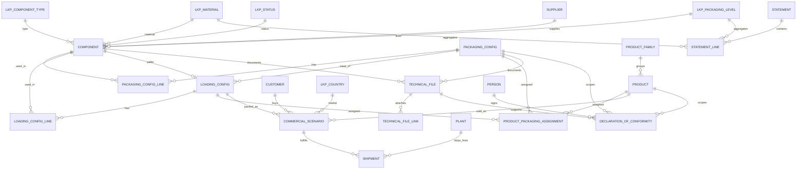

# PIMS Logical Data Model (Relational Database in Excel)

| Document | Version | Status | Date |
|----------|---------|--------|------|
| DATABASE.md | 0.1.1 | Architecture Complete | 2026-08-02 |

---

## 1. Purpose

This document defines the **normalized relational data model** for the İnci Akü PPWR Packaging Information Management System (PIMS).

Each Excel worksheet = one table.  
Each row = one record.  
Each `*_ID` = primary or foreign key.

**Design target:** Third Normal Form (3NF) for master/config/fact data.  
**Exception:** `STATEMENT_LINE` stores frozen compliance snapshots (controlled denormalization at the reporting boundary).

---

## 2. Normalization Rules Applied

| Rule | Application in PIMS |
|------|---------------------|
| 1NF | Atomic columns; no multi-value cells; no embedded component lists |
| 2NF | Line tables use their own PKs; quantities depend on the line, not partial keys only |
| 3NF | Material names, statuses, countries live in lookup tables—not repeated on facts |
| No weight duplication | Only `COMPONENT.WEIGHT_G` stores packaging item weight |
| No BOM duplication | Component membership only in `*_LINE` junction tables |
| Referential integrity | Every FK must resolve to an existing PK |

---

## 3. Entity Relationship Overview

```text
LKP_* ─────────────────────────────────────────────────────────────┐
                                                                   │
SUPPLIER ──┐                                                       │
CUSTOMER ──┤                                                       │
PLANT ─────┤                                                       │
PERSON ────┤                                                       │
PRODUCT_FAMILY ──< PRODUCT                                        │
                                                                   ▼
COMPONENT <── PACKAGING_CONFIG_LINE >── PACKAGING_CONFIG
     ^                                      │
     │                                      ▼
     └──── LOADING_CONFIG_LINE >── LOADING_CONFIG
                                          │
PRODUCT ──< PRODUCT_PACKAGING_ASSIGNMENT >┤
                                          │
CUSTOMER + COUNTRY + PRODUCT + LOADING_CONFIG
                │
                ▼
        COMMERCIAL_SCENARIO
                │
                ▼
            SHIPMENT
                │
                ▼ (aggregation / snapshot)
        STATEMENT ──< STATEMENT_LINE

COMPONENT or PACKAGING_CONFIG ──< TECHNICAL_FILE
TECHNICAL_FILE + PRODUCT/CONFIG ──< DECLARATION_OF_CONFORMITY
```

### 3.1 Logical ER Diagram (Mermaid)



### 3.2 Cardinality Summary (Core Path)

| Path | Cardinality | Notes |
|------|-------------|-------|
| COMPONENT → PACKAGING_CONFIG | M:N via `PACKAGING_CONFIG_LINE` | Quantity on line; weight on component |
| PACKAGING_CONFIG → LOADING_CONFIG | 1:N | One packed-unit BOM can underpin many load setups |
| LOADING_CONFIG → COMPONENT (extras) | M:N via `LOADING_CONFIG_LINE` | Tertiary / per-load items |
| PRODUCT → LOADING_CONFIG | M:N via `PRODUCT_PACKAGING_ASSIGNMENT` | Engineering defaults |
| PRODUCT + CUSTOMER + COUNTRY + LOADING → SCENARIO | N:1 parents | Commercial variant |
| SCENARIO → SHIPMENT | 1:N | Operational facts |
| SHIPMENT → STATEMENT_LINE | derived aggregate | Freeze on approval |

---

## 4. Primary Key Strategy

| Pattern | Example | Rule |
|---------|---------|------|
| Surrogate PK | `COMPONENT_ID` | Integer, unique, never reused, system-assigned |
| Business key | `COMPONENT_CODE` | Human-readable, unique among active records |
| Line PK | `PKG_CONFIG_LINE_ID` | Surrogate; do not rely only on composite natural keys |
| Alternate unique | `(PACKAGING_CONFIG_ID, COMPONENT_ID, LINE_ROLE_ID)` | Prevent duplicate BOM lines where business forbids them |

**Excel note:** IDs may be sequential integers managed by control logic or import routines. Business users work primarily with `*_CODE` fields; joins always use `*_ID`.

---

## 5. Lookup Tables (`LKP_*`)

Lookup tables are small, controlled vocabularies. Fact/master tables store **only the FK**, never the descriptive text as source data.

### 5.1 `LKP_STATUS`

| Column | Type | PK/FK | Required | Description |
|--------|------|-------|----------|-------------|
| STATUS_ID | INT | PK | Y | Surrogate key |
| STATUS_CODE | TEXT | UQ | Y | `DRAFT`, `ACTIVE`, `OBSOLETE`, `APPROVED`, `CANCELLED` |
| STATUS_NAME | TEXT | | Y | Display name |
| IS_EDITABLE | BOOL | | Y | Whether records in this status may be changed |
| SORT_ORDER | INT | | Y | UI ordering |

Used by: nearly all master/config/compliance entities.

### 5.2 `LKP_UOM`

| Column | Type | PK/FK | Required | Description |
|--------|------|-------|----------|-------------|
| UOM_ID | INT | PK | Y | Surrogate key |
| UOM_CODE | TEXT | UQ | Y | `G`, `KG`, `MM`, `PCS`, `PAL` |
| UOM_NAME | TEXT | | Y | Unit name |
| UOM_DIMENSION | TEXT | | Y | `MASS`, `LENGTH`, `COUNT` |

### 5.3 `LKP_PACKAGING_LEVEL`

| Column | Type | PK/FK | Required | Description |
|--------|------|-------|----------|-------------|
| PACKAGING_LEVEL_ID | INT | PK | Y | Surrogate key |
| PACKAGING_LEVEL_CODE | TEXT | UQ | Y | `PRIMARY`, `SECONDARY`, `TERTIARY` |
| PACKAGING_LEVEL_NAME | TEXT | | Y | Display name |
| SORT_ORDER | INT | | Y | 1..3 |

### 5.4 `LKP_COMPONENT_TYPE`

| Column | Type | PK/FK | Required | Description |
|--------|------|-------|----------|-------------|
| COMPONENT_TYPE_ID | INT | PK | Y | Surrogate key |
| COMPONENT_TYPE_CODE | TEXT | UQ | Y | `CARTON`, `DIVIDER`, `FILM`, `STRAP`, `LABEL`, `PALLET`, `BAG`, `CAP`, `OTHER` |
| COMPONENT_TYPE_NAME | TEXT | | Y | Display name |
| DEFAULT_PACKAGING_LEVEL_ID | INT | FK → LKP_PACKAGING_LEVEL | N | Suggested level |

### 5.5 `LKP_MATERIAL`

| Column | Type | PK/FK | Required | Description |
|--------|------|-------|----------|-------------|
| MATERIAL_ID | INT | PK | Y | Surrogate key |
| MATERIAL_CODE | TEXT | UQ | Y | e.g. `PAPER_BOARD`, `LDPE`, `PET`, `WOOD`, `STEEL`, `ALUMINIUM`, `COMPOSITE` |
| MATERIAL_NAME | TEXT | | Y | Display name |
| MATERIAL_FAMILY | TEXT | | Y | Broad family for reporting |
| PPWR_CATEGORY_CODE | TEXT | | N | Mapping aid for PPWR material category |
| IS_COMPOSITE | BOOL | | Y | Composite flag |
| NOTES | TEXT | | N | Guidance |

### 5.6 `LKP_RECYCLABILITY_CLASS`

| Column | Type | PK/FK | Required | Description |
|--------|------|-------|----------|-------------|
| RECYCLABILITY_CLASS_ID | INT | PK | Y | Surrogate key |
| RECYCLABILITY_CLASS_CODE | TEXT | UQ | Y | Controlled class codes |
| RECYCLABILITY_CLASS_NAME | TEXT | | Y | Display name |
| DESCRIPTION | TEXT | | N | Assessment meaning |

### 5.7 `LKP_COUNTRY`

| Column | Type | PK/FK | Required | Description |
|--------|------|-------|----------|-------------|
| COUNTRY_ID | INT | PK | Y | Surrogate key |
| ISO2 | TEXT | UQ | Y | ISO 3166-1 alpha-2 |
| ISO3 | TEXT | UQ | Y | ISO 3166-1 alpha-3 |
| COUNTRY_NAME | TEXT | | Y | English/official name |
| IS_EU_MARKET | BOOL | | Y | EU / PPWR market relevance |

### 5.8 `LKP_CURRENCY`

| Column | Type | PK/FK | Required | Description |
|--------|------|-------|----------|-------------|
| CURRENCY_ID | INT | PK | Y | Surrogate key |
| CURRENCY_CODE | TEXT | UQ | Y | ISO 4217 (`EUR`, `TRY`, …) |
| CURRENCY_NAME | TEXT | | Y | Display name |

### 5.9 `LKP_TRANSPORT_MODE`

| Column | Type | PK/FK | Required | Description |
|--------|------|-------|----------|-------------|
| TRANSPORT_MODE_ID | INT | PK | Y | Surrogate key |
| TRANSPORT_MODE_CODE | TEXT | UQ | Y | `ROAD`, `SEA`, `AIR`, `RAIL`, `MULTI` |
| TRANSPORT_MODE_NAME | TEXT | | Y | Display name |

### 5.10 `LKP_STATEMENT_TYPE`

| Column | Type | PK/FK | Required | Description |
|--------|------|-------|----------|-------------|
| STATEMENT_TYPE_ID | INT | PK | Y | Surrogate key |
| STATEMENT_TYPE_CODE | TEXT | UQ | Y | `ANNUAL_MARKET`, `QUARTERLY`, `INTERNAL_AUDIT` |
| STATEMENT_TYPE_NAME | TEXT | | Y | Display name |

### 5.11 `LKP_DOC_TYPE`

| Column | Type | PK/FK | Required | Description |
|--------|------|-------|----------|-------------|
| DOC_TYPE_ID | INT | PK | Y | Surrogate key |
| DOC_TYPE_CODE | TEXT | UQ | Y | `TECH_FILE`, `TEST_REPORT`, `SPEC`, `DoC`, `OTHER` |
| DOC_TYPE_NAME | TEXT | | Y | Display name |

### 5.12 `LKP_LINE_ROLE`

| Column | Type | PK/FK | Required | Description |
|--------|------|-------|----------|-------------|
| LINE_ROLE_ID | INT | PK | Y | Surrogate key |
| LINE_ROLE_CODE | TEXT | UQ | Y | `BASE`, `OPTIONAL`, `LAYER_PAD`, `PALLET_WRAP`, `CORNER` |
| LINE_ROLE_NAME | TEXT | | Y | Role in configuration |

### 5.13 `LKP_INCOTERM` (optional but recommended)

| Column | Type | PK/FK | Required | Description |
|--------|------|-------|----------|-------------|
| INCOTERM_ID | INT | PK | Y | Surrogate key |
| INCOTERM_CODE | TEXT | UQ | Y | `EXW`, `FCA`, `FOB`, `CIF`, `DAP`, `DDP`, … |
| INCOTERM_NAME | TEXT | | Y | Display name |

---

## 6. Party / Organization Masters

### 6.1 `SUPPLIER`

| Column | Type | PK/FK | Required | Description |
|--------|------|-------|----------|-------------|
| SUPPLIER_ID | INT | PK | Y | Surrogate key |
| SUPPLIER_CODE | TEXT | UQ | Y | Business code |
| SUPPLIER_NAME | TEXT | | Y | Legal/trade name |
| COUNTRY_ID | INT | FK → LKP_COUNTRY | N | Supplier country |
| STATUS_ID | INT | FK → LKP_STATUS | Y | Record status |
| NOTES | TEXT | | N | Free notes |
| CREATED_AT | DATETIME | | Y | Audit |
| UPDATED_AT | DATETIME | | Y | Audit |

### 6.2 `CUSTOMER`

| Column | Type | PK/FK | Required | Description |
|--------|------|-------|----------|-------------|
| CUSTOMER_ID | INT | PK | Y | Surrogate key |
| CUSTOMER_CODE | TEXT | UQ | Y | Business code |
| CUSTOMER_NAME | TEXT | | Y | Name |
| COUNTRY_ID | INT | FK → LKP_COUNTRY | N | Default country |
| STATUS_ID | INT | FK → LKP_STATUS | Y | Record status |
| NOTES | TEXT | | N | Notes |
| CREATED_AT | DATETIME | | Y | Audit |
| UPDATED_AT | DATETIME | | Y | Audit |

### 6.3 `PLANT`

| Column | Type | PK/FK | Required | Description |
|--------|------|-------|----------|-------------|
| PLANT_ID | INT | PK | Y | Surrogate key |
| PLANT_CODE | TEXT | UQ | Y | Plant code |
| PLANT_NAME | TEXT | | Y | Plant name |
| COUNTRY_ID | INT | FK → LKP_COUNTRY | Y | Location country |
| STATUS_ID | INT | FK → LKP_STATUS | Y | Record status |

### 6.4 `PERSON`

| Column | Type | PK/FK | Required | Description |
|--------|------|-------|----------|-------------|
| PERSON_ID | INT | PK | Y | Surrogate key |
| PERSON_CODE | TEXT | UQ | Y | Employee/user code |
| FULL_NAME | TEXT | | Y | Display name |
| EMAIL | TEXT | | N | Contact |
| ROLE_TITLE | TEXT | | N | e.g. Compliance Officer |
| STATUS_ID | INT | FK → LKP_STATUS | Y | Record status |

Used as approver / DoC responsible person.

### 6.5 `PRODUCT_FAMILY`

| Column | Type | PK/FK | Required | Description |
|--------|------|-------|----------|-------------|
| PRODUCT_FAMILY_ID | INT | PK | Y | Surrogate key |
| PRODUCT_FAMILY_CODE | TEXT | UQ | Y | Family code |
| PRODUCT_FAMILY_NAME | TEXT | | Y | Family name |
| STATUS_ID | INT | FK → LKP_STATUS | Y | Record status |

---

## 7. Core Master: `COMPONENT` (Packaging Components)

**Definition:** Atomic packaging item. **Single owner of packaging unit weight.**

| Column | Type | PK/FK | Required | Description |
|--------|------|-------|----------|-------------|
| COMPONENT_ID | INT | PK | Y | Surrogate key |
| COMPONENT_CODE | TEXT | UQ | Y | Business key (e.g. `PKG-CTN-001`) |
| COMPONENT_NAME | TEXT | | Y | Descriptive name |
| COMPONENT_TYPE_ID | INT | FK → LKP_COMPONENT_TYPE | Y | Type |
| MATERIAL_ID | INT | FK → LKP_MATERIAL | Y | Material |
| PACKAGING_LEVEL_ID | INT | FK → LKP_PACKAGING_LEVEL | Y | Primary/Secondary/Tertiary |
| SUPPLIER_ID | INT | FK → SUPPLIER | N | Preferred supplier |
| WEIGHT_G | DECIMAL | | Y | **Unit weight in grams (source of truth)** |
| LENGTH_MM | DECIMAL | | N | Outer length |
| WIDTH_MM | DECIMAL | | N | Outer width |
| HEIGHT_MM | DECIMAL | | N | Outer height |
| RECYCLED_CONTENT_PCT | DECIMAL | | N | 0–100 |
| RECYCLABILITY_CLASS_ID | INT | FK → LKP_RECYCLABILITY_CLASS | N | Class |
| IS_REUSABLE | BOOL | | Y | Reusable packaging flag |
| REUSE_CYCLE_TARGET | INT | | N | Target reuse cycles |
| COLOR_DESC | TEXT | | N | Optional descriptor |
| SPEC_REF | TEXT | | N | Drawing/spec reference |
| STATUS_ID | INT | FK → LKP_STATUS | Y | Draft/Active/Obsolete |
| EFFECTIVE_FROM | DATE | | Y | Validity start |
| EFFECTIVE_TO | DATE | | N | Validity end |
| NOTES | TEXT | | N | Notes |
| CREATED_AT | DATETIME | | Y | Audit |
| UPDATED_AT | DATETIME | | Y | Audit |
| CREATED_BY_PERSON_ID | INT | FK → PERSON | N | Audit |

**Foreign keys explained**

| FK | Why it exists |
|----|----------------|
| COMPONENT_TYPE_ID | Classifies item without free text |
| MATERIAL_ID | PPWR material reporting dimension |
| PACKAGING_LEVEL_ID | Primary/secondary/tertiary reporting |
| SUPPLIER_ID | Traceability of packaging supply |
| RECYCLABILITY_CLASS_ID | Controlled recyclability vocabulary |
| STATUS_ID | Lifecycle control |
| CREATED_BY_PERSON_ID | Accountability |

**Validation (Component)**

- `WEIGHT_G > 0`
- `RECYCLED_CONTENT_PCT` null or `0..100`
- `EFFECTIVE_TO` null or `>= EFFECTIVE_FROM`
- `COMPONENT_CODE` unique
- Active components referenced by active config lines should not be set Obsolete without impact check

---

## 8. Packaging Configurations

### 8.1 `PACKAGING_CONFIG` (header)

**Definition:** Named BOM assembly of components packing one product/sales unit.

| Column | Type | PK/FK | Required | Description |
|--------|------|-------|----------|-------------|
| PACKAGING_CONFIG_ID | INT | PK | Y | Surrogate key |
| PACKAGING_CONFIG_CODE | TEXT | UQ | Y | Business key |
| PACKAGING_CONFIG_NAME | TEXT | | Y | Name |
| DESCRIPTION | TEXT | | N | Description |
| VERSION_NO | INT | | Y | Version number (>=1) |
| STATUS_ID | INT | FK → LKP_STATUS | Y | Lifecycle |
| EFFECTIVE_FROM | DATE | | Y | Validity start |
| EFFECTIVE_TO | DATE | | N | Validity end |
| NOTES | TEXT | | N | Notes |
| CREATED_AT | DATETIME | | Y | Audit |
| UPDATED_AT | DATETIME | | Y | Audit |

**Explicitly NOT stored as editable source fields**

- Total packaging weight  
- Material breakdown totals  

These are calculated from lines × `COMPONENT.WEIGHT_G`.

### 8.2 `PACKAGING_CONFIG_LINE` (junction / BOM)

**Definition:** Many-to-many between packaging configuration and components.

| Column | Type | PK/FK | Required | Description |
|--------|------|-------|----------|-------------|
| PKG_CONFIG_LINE_ID | INT | PK | Y | Surrogate key |
| PACKAGING_CONFIG_ID | INT | FK → PACKAGING_CONFIG | Y | Parent config |
| COMPONENT_ID | INT | FK → COMPONENT | Y | Component used |
| QUANTITY | DECIMAL | | Y | Qty per one packed unit |
| LINE_ROLE_ID | INT | FK → LKP_LINE_ROLE | Y | Role |
| SORT_ORDER | INT | | Y | Display/assembly order |
| IS_OPTIONAL | BOOL | | Y | Optional line flag |
| NOTES | TEXT | | N | Line notes |

**Unique business constraint (recommended):**  
`(PACKAGING_CONFIG_ID, COMPONENT_ID, LINE_ROLE_ID)` unique.

**Foreign keys explained**

| FK | Why |
|----|-----|
| PACKAGING_CONFIG_ID | Belongs to one config header |
| COMPONENT_ID | Points to weight/material master—no copied weight |
| LINE_ROLE_ID | Distinguishes same component used in different roles if needed |

**Derived metric**

```text
PackagingConfigWeight_G =
  Σ (COMPONENT.WEIGHT_G × PACKAGING_CONFIG_LINE.QUANTITY)
  for all non-optional-or-included lines
```

---

## 9. Loading Configurations

### 9.1 `LOADING_CONFIG` (header)

**Definition:** How packed units are unitized for storage/transport.

| Column | Type | PK/FK | Required | Description |
|--------|------|-------|----------|-------------|
| LOADING_CONFIG_ID | INT | PK | Y | Surrogate key |
| LOADING_CONFIG_CODE | TEXT | UQ | Y | Business key |
| LOADING_CONFIG_NAME | TEXT | | Y | Name |
| PACKAGING_CONFIG_ID | INT | FK → PACKAGING_CONFIG | Y | Base packed-unit config |
| UNITS_PER_LAYER | INT | | Y | Packed units per layer |
| LAYERS_PER_LOAD | INT | | Y | Layers per pallet/load |
| PALLET_COMPONENT_ID | INT | FK → COMPONENT | N | Pallet component (if used) |
| MAX_LOAD_WEIGHT_KG | DECIMAL | | N | Engineering limit (not packaging composition weight) |
| VERSION_NO | INT | | Y | Version |
| STATUS_ID | INT | FK → LKP_STATUS | Y | Lifecycle |
| EFFECTIVE_FROM | DATE | | Y | Validity start |
| EFFECTIVE_TO | DATE | | N | Validity end |
| NOTES | TEXT | | N | Notes |
| CREATED_AT | DATETIME | | Y | Audit |
| UPDATED_AT | DATETIME | | Y | Audit |

**Derived (not stored as source)**

```text
UNITS_PER_LOAD = UNITS_PER_LAYER × LAYERS_PER_LOAD
```

**Foreign keys explained**

| FK | Why |
|----|-----|
| PACKAGING_CONFIG_ID | Reuses packed-unit BOM; no component rewrite |
| PALLET_COMPONENT_ID | Pallet is a component master with its own weight |
| STATUS_ID | Lifecycle |

### 9.2 `LOADING_CONFIG_LINE` (tertiary / load extras)

**Definition:** Extra components applied at load level (stretch wrap, edge boards, labels per pallet, etc.), allocated per load—not per product unit.

| Column | Type | PK/FK | Required | Description |
|--------|------|-------|----------|-------------|
| LOADING_CONFIG_LINE_ID | INT | PK | Y | Surrogate key |
| LOADING_CONFIG_ID | INT | FK → LOADING_CONFIG | Y | Parent |
| COMPONENT_ID | INT | FK → COMPONENT | Y | Extra component |
| QUANTITY_PER_LOAD | DECIMAL | | Y | Qty per one load/pallet |
| LINE_ROLE_ID | INT | FK → LKP_LINE_ROLE | Y | Role |
| SORT_ORDER | INT | | Y | Order |
| NOTES | TEXT | | N | Notes |

**Allocation rule for per-unit packaging accounting**

```text
ExtraPerPackedUnit_G =
  Σ (COMPONENT.WEIGHT_G × QUANTITY_PER_LOAD) / UNITS_PER_LOAD
```

Pallet weight (if `PALLET_COMPONENT_ID` set) is allocated the same way unless business chooses “per load” reporting only—documented as a reporting parameter on `SYS_PARAMETER`.

---

## 10. Products

### 10.1 `PRODUCT`

| Column | Type | PK/FK | Required | Description |
|--------|------|-------|----------|-------------|
| PRODUCT_ID | INT | PK | Y | Surrogate key |
| PRODUCT_CODE | TEXT | UQ | Y | SKU / material code |
| PRODUCT_NAME | TEXT | | Y | Product name |
| PRODUCT_FAMILY_ID | INT | FK → PRODUCT_FAMILY | N | Family |
| NET_WEIGHT_G | DECIMAL | | Y | **Battery/product net weight (not packaging)** |
| LENGTH_MM | DECIMAL | | N | Product length |
| WIDTH_MM | DECIMAL | | N | Product width |
| HEIGHT_MM | DECIMAL | | N | Product height |
| STATUS_ID | INT | FK → LKP_STATUS | Y | Lifecycle |
| EFFECTIVE_FROM | DATE | | Y | Validity start |
| EFFECTIVE_TO | DATE | | N | Validity end |
| NOTES | TEXT | | N | Notes |
| CREATED_AT | DATETIME | | Y | Audit |
| UPDATED_AT | DATETIME | | Y | Audit |

**Important:** Packaging weight is never stored on `PRODUCT`.

### 10.2 `PRODUCT_PACKAGING_ASSIGNMENT` (junction)

**Definition:** Which packaging/loading setups are valid for a product (engineering defaults), independent of a specific customer scenario.

| Column | Type | PK/FK | Required | Description |
|--------|------|-------|----------|-------------|
| PRODUCT_PKG_ASSIGN_ID | INT | PK | Y | Surrogate key |
| PRODUCT_ID | INT | FK → PRODUCT | Y | Product |
| PACKAGING_CONFIG_ID | INT | FK → PACKAGING_CONFIG | N | Optional direct pkg link |
| LOADING_CONFIG_ID | INT | FK → LOADING_CONFIG | N | Preferred load link |
| IS_DEFAULT | BOOL | | Y | Default assignment flag |
| STATUS_ID | INT | FK → LKP_STATUS | Y | Lifecycle |
| EFFECTIVE_FROM | DATE | | Y | Validity start |
| EFFECTIVE_TO | DATE | | N | Validity end |
| NOTES | TEXT | | N | Notes |

**XOR / consistency rule:** At least one of `PACKAGING_CONFIG_ID` or `LOADING_CONFIG_ID` required. If both present, `LOADING_CONFIG.PACKAGING_CONFIG_ID` must equal `PACKAGING_CONFIG_ID`.

---

## 11. Commercial Scenarios

### 11.1 `COMMERCIAL_SCENARIO`

**Definition:** Commercial packaging variant used for selling/shipping a product to a customer/market.

| Column | Type | PK/FK | Required | Description |
|--------|------|-------|----------|-------------|
| SCENARIO_ID | INT | PK | Y | Surrogate key |
| SCENARIO_CODE | TEXT | UQ | Y | Business key |
| SCENARIO_NAME | TEXT | | Y | Name |
| PRODUCT_ID | INT | FK → PRODUCT | Y | Sold product |
| LOADING_CONFIG_ID | INT | FK → LOADING_CONFIG | Y | How it is packed/loaded |
| CUSTOMER_ID | INT | FK → CUSTOMER | Y | Customer |
| DESTINATION_COUNTRY_ID | INT | FK → LKP_COUNTRY | Y | Target market/country |
| INCOTERM_ID | INT | FK → LKP_INCOTERM | N | Commercial term |
| CURRENCY_ID | INT | FK → LKP_CURRENCY | N | Commercial currency |
| TRANSPORT_MODE_ID | INT | FK → LKP_TRANSPORT_MODE | N | Typical mode |
| STATUS_ID | INT | FK → LKP_STATUS | Y | Lifecycle |
| VALID_FROM | DATE | | Y | Commercial validity start |
| VALID_TO | DATE | | N | Commercial validity end |
| NOTES | TEXT | | N | Notes |
| CREATED_AT | DATETIME | | Y | Audit |
| UPDATED_AT | DATETIME | | Y | Audit |

**Foreign keys explained**

| FK | Why |
|----|-----|
| PRODUCT_ID | What is sold |
| LOADING_CONFIG_ID | Which packaging/loading BOM applies (implies packaging config) |
| CUSTOMER_ID | Who buys |
| DESTINATION_COUNTRY_ID | Market for PPWR placement logic |
| INCOTERM_ID / CURRENCY_ID / TRANSPORT_MODE_ID | Commercial context without free text |

**Unique business constraint (recommended):**  
`(PRODUCT_ID, CUSTOMER_ID, DESTINATION_COUNTRY_ID, LOADING_CONFIG_ID, VALID_FROM)` unique.

---

## 12. Shipments

### 12.1 `SHIPMENT`

**Definition:** Operational fact of quantity placed into a logistics movement under a commercial scenario.

| Column | Type | PK/FK | Required | Description |
|--------|------|-------|----------|-------------|
| SHIPMENT_ID | INT | PK | Y | Surrogate key |
| SHIPMENT_NUMBER | TEXT | UQ | Y | Business document/number |
| SCENARIO_ID | INT | FK → COMMERCIAL_SCENARIO | Y | Commercial/packaging context |
| PLANT_ID | INT | FK → PLANT | Y | Ship-from plant |
| SHIP_DATE | DATE | | Y | Shipment date |
| QTY_PRODUCT_UNITS | DECIMAL | | Y | Number of product units shipped |
| DEST_COUNTRY_ID | INT | FK → LKP_COUNTRY | N | Override destination if needed |
| TRANSPORT_MODE_ID | INT | FK → LKP_TRANSPORT_MODE | N | Actual mode |
| STATUS_ID | INT | FK → LKP_STATUS | Y | Draft/Confirmed/Cancelled |
| EXTERNAL_REF | TEXT | | N | ERP/DN reference |
| NOTES | TEXT | | N | Notes |
| CREATED_AT | DATETIME | | Y | Audit |
| UPDATED_AT | DATETIME | | Y | Audit |

**Why scenario FK is preferred**

Shipment inherits Product, Customer, Loading Config (and thus Packaging Config + Components) from `COMMERCIAL_SCENARIO`. This avoids re-entering those attributes and prevents contradictory combinations.

`DEST_COUNTRY_ID` may override scenario destination only when logistics destination differs; if null, use scenario destination.

**Derived packaging placed on market (per shipment)**

```text
For each component contribution in Loading Config composition:
  ShippedComponentWeight_G =
      (per-unit allocated component grams) × QTY_PRODUCT_UNITS
```

No component weight is stored on `SHIPMENT`.

---

## 13. Statements

### 13.1 `STATEMENT` (header)

**Definition:** Compliance reporting package for a period and market/scope.

| Column | Type | PK/FK | Required | Description |
|--------|------|-------|----------|-------------|
| STATEMENT_ID | INT | PK | Y | Surrogate key |
| STATEMENT_CODE | TEXT | UQ | Y | Business key |
| STATEMENT_TYPE_ID | INT | FK → LKP_STATEMENT_TYPE | Y | Type |
| COUNTRY_ID | INT | FK → LKP_COUNTRY | Y | Market scope |
| PERIOD_YEAR | INT | | Y | e.g. 2026 |
| PERIOD_MONTH | INT | | N | 1–12 if monthly |
| PERIOD_FROM | DATE | | Y | Inclusive |
| PERIOD_TO | DATE | | Y | Inclusive |
| STATUS_ID | INT | FK → LKP_STATUS | Y | Draft/Approved |
| GENERATED_AT | DATETIME | | N | Generation timestamp |
| APPROVED_BY_PERSON_ID | INT | FK → PERSON | N | Approver |
| APPROVED_AT | DATETIME | | N | Approval timestamp |
| NOTES | TEXT | | N | Notes |

### 13.2 `STATEMENT_LINE` (frozen snapshot)

**Definition:** Aggregated packaging weights by material and packaging level for the statement.  
**This is the only intentional denormalized weight storage**—for audit freeze after approval.

| Column | Type | PK/FK | Required | Description |
|--------|------|-------|----------|-------------|
| STATEMENT_LINE_ID | INT | PK | Y | Surrogate key |
| STATEMENT_ID | INT | FK → STATEMENT | Y | Parent |
| MATERIAL_ID | INT | FK → LKP_MATERIAL | Y | Material |
| PACKAGING_LEVEL_ID | INT | FK → LKP_PACKAGING_LEVEL | Y | Level |
| TOTAL_WEIGHT_KG | DECIMAL | | Y | Frozen total |
| RECYCLED_CONTENT_WEIGHT_KG | DECIMAL | | N | Frozen recycled portion |
| REUSABLE_WEIGHT_KG | DECIMAL | | N | Frozen reusable portion |
| SOURCE_SHIPMENT_COUNT | INT | | N | Audit aid |
| NOTES | TEXT | | N | Notes |

**Unique constraint:** `(STATEMENT_ID, MATERIAL_ID, PACKAGING_LEVEL_ID)`.

**Immutability rule:** When `STATEMENT.STATUS = APPROVED`, lines become read-only. Corrections require a new statement version/record.

---

## 14. Technical File Data

### 14.1 `TECHNICAL_FILE`

**Definition:** Structured technical documentation record supporting PPWR conformity evidence for a component **or** a packaging configuration.

| Column | Type | PK/FK | Required | Description |
|--------|------|-------|----------|-------------|
| TECHNICAL_FILE_ID | INT | PK | Y | Surrogate key |
| TECHNICAL_FILE_CODE | TEXT | UQ | Y | Business key |
| TITLE | TEXT | | Y | Document title |
| COMPONENT_ID | INT | FK → COMPONENT | N | Subject component |
| PACKAGING_CONFIG_ID | INT | FK → PACKAGING_CONFIG | N | Subject config |
| DOC_TYPE_ID | INT | FK → LKP_DOC_TYPE | Y | Document class |
| VERSION_NO | INT | | Y | Version |
| ASSESSMENT_DATE | DATE | | N | Assessment date |
| RECYCLABILITY_SUMMARY | TEXT | | N | Summary text |
| SUBSTANCE_OF_CONCERN_NOTES | TEXT | | N | SoC notes |
| DESIGN_FOR_RECYCLING_NOTES | TEXT | | N | DfR notes |
| EVIDENCE_PATH | TEXT | | N | Link/path to file share |
| STATUS_ID | INT | FK → LKP_STATUS | Y | Lifecycle |
| OWNER_PERSON_ID | INT | FK → PERSON | N | Owner |
| EFFECTIVE_FROM | DATE | | Y | Validity start |
| EFFECTIVE_TO | DATE | | N | Validity end |
| NOTES | TEXT | | N | Notes |
| CREATED_AT | DATETIME | | Y | Audit |
| UPDATED_AT | DATETIME | | Y | Audit |

**XOR rule (mandatory):** Exactly one of `COMPONENT_ID` or `PACKAGING_CONFIG_ID` must be non-null.

### 14.2 `TECHNICAL_FILE_LINK` (optional attachments index)

| Column | Type | PK/FK | Required | Description |
|--------|------|-------|----------|-------------|
| TECH_FILE_LINK_ID | INT | PK | Y | Surrogate key |
| TECHNICAL_FILE_ID | INT | FK → TECHNICAL_FILE | Y | Parent |
| LINK_LABEL | TEXT | | Y | Label |
| LINK_URI | TEXT | | Y | Path/URL |
| DOC_TYPE_ID | INT | FK → LKP_DOC_TYPE | N | Attachment type |
| SORT_ORDER | INT | | Y | Order |

---

## 15. Declaration of Conformity Data

### 15.1 `DECLARATION_OF_CONFORMITY`

**Definition:** Formal DoC record declaring conformity for a defined scope.

| Column | Type | PK/FK | Required | Description |
|--------|------|-------|----------|-------------|
| DOC_ID | INT | PK | Y | Surrogate key |
| DOC_NUMBER | TEXT | UQ | Y | DoC number |
| TITLE | TEXT | | Y | Title |
| PRODUCT_ID | INT | FK → PRODUCT | N | Scope product |
| PACKAGING_CONFIG_ID | INT | FK → PACKAGING_CONFIG | N | Scope packaging |
| TECHNICAL_FILE_ID | INT | FK → TECHNICAL_FILE | Y | Supporting tech file |
| RESPONSIBLE_PERSON_ID | INT | FK → PERSON | Y | Signatory/responsible |
| REGULATION_REFERENCE | TEXT | | Y | e.g. PPWR citation |
| CONFORMITY_STATEMENT | TEXT | | Y | Formal statement text |
| ISSUE_DATE | DATE | | Y | Issue date |
| VALID_UNTIL | DATE | | N | Expiry |
| STATUS_ID | INT | FK → LKP_STATUS | Y | Draft/Approved/Revoked |
| APPROVED_AT | DATETIME | | N | Approval timestamp |
| NOTES | TEXT | | N | Notes |
| CREATED_AT | DATETIME | | Y | Audit |
| UPDATED_AT | DATETIME | | Y | Audit |

**Scope rule:** At least one of `PRODUCT_ID` or `PACKAGING_CONFIG_ID` required.  
If both present, product must be assigned to that packaging config via `PRODUCT_PACKAGING_ASSIGNMENT` or an active scenario.

---

## 16. System Tables

### 16.1 `SYS_PARAMETER`

| Column | Type | PK/FK | Required | Description |
|--------|------|-------|----------|-------------|
| PARAMETER_ID | INT | PK | Y | Surrogate key |
| PARAMETER_CODE | TEXT | UQ | Y | e.g. `WEIGHT_UOM`, `PALLET_ALLOCATION_METHOD` |
| PARAMETER_VALUE | TEXT | | Y | Value |
| DESCRIPTION | TEXT | | N | Meaning |

### 16.2 `SYS_WORKBOOK_INFO`

| Column | Type | PK/FK | Required | Description |
|--------|------|-------|----------|-------------|
| INFO_KEY | TEXT | PK | Y | e.g. `SCHEMA_VERSION` |
| INFO_VALUE | TEXT | | Y | Value |
| UPDATED_AT | DATETIME | | Y | Timestamp |

### 16.3 `SYS_VALIDATION_LOG` (later automation)

| Column | Type | PK/FK | Required | Description |
|--------|------|-------|----------|-------------|
| VALIDATION_LOG_ID | INT | PK | Y | Surrogate key |
| RUN_AT | DATETIME | | Y | Run time |
| RULE_CODE | TEXT | | Y | Rule id |
| SEVERITY | TEXT | | Y | `ERROR` / `WARN` |
| ENTITY_NAME | TEXT | | Y | Table |
| RECORD_ID | INT | | N | Row id |
| MESSAGE | TEXT | | Y | Detail |

---

## 17. Complete Foreign Key Map

| FK Column | Child Table | Parent Table | Delete/Change Policy (logical) |
|-----------|-------------|--------------|--------------------------------|
| COMPONENT.COMPONENT_TYPE_ID | COMPONENT | LKP_COMPONENT_TYPE | Restrict |
| COMPONENT.MATERIAL_ID | COMPONENT | LKP_MATERIAL | Restrict |
| COMPONENT.PACKAGING_LEVEL_ID | COMPONENT | LKP_PACKAGING_LEVEL | Restrict |
| COMPONENT.SUPPLIER_ID | COMPONENT | SUPPLIER | Set null / Restrict if required |
| COMPONENT.RECYCLABILITY_CLASS_ID | COMPONENT | LKP_RECYCLABILITY_CLASS | Restrict |
| COMPONENT.STATUS_ID | COMPONENT | LKP_STATUS | Restrict |
| PACKAGING_CONFIG_LINE.PACKAGING_CONFIG_ID | PACKAGING_CONFIG_LINE | PACKAGING_CONFIG | Cascade line remove with header (controlled) |
| PACKAGING_CONFIG_LINE.COMPONENT_ID | PACKAGING_CONFIG_LINE | COMPONENT | Restrict if component in use |
| LOADING_CONFIG.PACKAGING_CONFIG_ID | LOADING_CONFIG | PACKAGING_CONFIG | Restrict |
| LOADING_CONFIG.PALLET_COMPONENT_ID | LOADING_CONFIG | COMPONENT | Restrict |
| LOADING_CONFIG_LINE.LOADING_CONFIG_ID | LOADING_CONFIG_LINE | LOADING_CONFIG | Cascade (controlled) |
| LOADING_CONFIG_LINE.COMPONENT_ID | LOADING_CONFIG_LINE | COMPONENT | Restrict |
| PRODUCT.PRODUCT_FAMILY_ID | PRODUCT | PRODUCT_FAMILY | Restrict |
| PRODUCT_PACKAGING_ASSIGNMENT.* | PRODUCT_PACKAGING_ASSIGNMENT | PRODUCT / CONFIGS | Restrict |
| COMMERCIAL_SCENARIO.PRODUCT_ID | COMMERCIAL_SCENARIO | PRODUCT | Restrict |
| COMMERCIAL_SCENARIO.LOADING_CONFIG_ID | COMMERCIAL_SCENARIO | LOADING_CONFIG | Restrict |
| COMMERCIAL_SCENARIO.CUSTOMER_ID | COMMERCIAL_SCENARIO | CUSTOMER | Restrict |
| COMMERCIAL_SCENARIO.DESTINATION_COUNTRY_ID | COMMERCIAL_SCENARIO | LKP_COUNTRY | Restrict |
| SHIPMENT.SCENARIO_ID | SHIPMENT | COMMERCIAL_SCENARIO | Restrict |
| SHIPMENT.PLANT_ID | SHIPMENT | PLANT | Restrict |
| STATEMENT.STATEMENT_TYPE_ID | STATEMENT | LKP_STATEMENT_TYPE | Restrict |
| STATEMENT.COUNTRY_ID | STATEMENT | LKP_COUNTRY | Restrict |
| STATEMENT_LINE.STATEMENT_ID | STATEMENT_LINE | STATEMENT | Cascade with statement |
| STATEMENT_LINE.MATERIAL_ID | STATEMENT_LINE | LKP_MATERIAL | Restrict |
| STATEMENT_LINE.PACKAGING_LEVEL_ID | STATEMENT_LINE | LKP_PACKAGING_LEVEL | Restrict |
| TECHNICAL_FILE.COMPONENT_ID | TECHNICAL_FILE | COMPONENT | Restrict |
| TECHNICAL_FILE.PACKAGING_CONFIG_ID | TECHNICAL_FILE | PACKAGING_CONFIG | Restrict |
| DECLARATION_OF_CONFORMITY.TECHNICAL_FILE_ID | DECLARATION_OF_CONFORMITY | TECHNICAL_FILE | Restrict |
| DECLARATION_OF_CONFORMITY.RESPONSIBLE_PERSON_ID | DECLARATION_OF_CONFORMITY | PERSON | Restrict |

**Excel enforcement:** Restrict/Cascade are logical policies enforced by validation routines (Phase D), not native SQL engine actions.

---

## 18. Validation Logic (Business Rules Catalog)

### 18.1 Key Integrity

| Rule ID | Rule | Severity |
|---------|------|----------|
| V-PK-01 | Every table PK unique and non-null | ERROR |
| V-BK-01 | Every business `*_CODE` / `*_NUMBER` unique | ERROR |
| V-FK-01 | Every non-null FK exists in parent PK set | ERROR |
| V-FK-02 | No orphan line rows without header | ERROR |

### 18.2 Weight & Quantity

| Rule ID | Rule | Severity |
|---------|------|----------|
| V-WT-01 | `COMPONENT.WEIGHT_G > 0` | ERROR |
| V-WT-02 | No editable total-weight column on config/shipment masters | ERROR |
| V-WT-03 | `PRODUCT.NET_WEIGHT_G > 0` | ERROR |
| V-QTY-01 | All line quantities `> 0` | ERROR |
| V-QTY-02 | `UNITS_PER_LAYER > 0` and `LAYERS_PER_LOAD > 0` | ERROR |

### 18.3 Configuration Consistency

| Rule ID | Rule | Severity |
|---------|------|----------|
| V-CFG-01 | Packaging config must have ≥1 line to be ACTIVE | ERROR |
| V-CFG-02 | Loading config ACTIVE only if packaging config ACTIVE | ERROR |
| V-CFG-03 | Product assignment XOR/consistency rule (§10.2) | ERROR |
| V-CFG-04 | Active scenario dates must overlap active loading config dates | WARN |
| V-CFG-05 | Pallet component, if set, should be tertiary / pallet type | WARN |

### 18.4 Commercial & Shipment

| Rule ID | Rule | Severity |
|---------|------|----------|
| V-SCN-01 | Scenario product/loading assignment recommended to exist in `PRODUCT_PACKAGING_ASSIGNMENT` | WARN |
| V-SHP-01 | `QTY_PRODUCT_UNITS > 0` | ERROR |
| V-SHP-02 | Cancelled shipments excluded from statement aggregation | ERROR |
| V-SHP-03 | Ship date within or flagged outside scenario validity | WARN |

### 18.5 Compliance Documents

| Rule ID | Rule | Severity |
|---------|------|----------|
| V-TF-01 | Technical file XOR subject rule | ERROR |
| V-DOC-01 | DoC requires Technical File + Responsible Person | ERROR |
| V-DOC-02 | DoC scope requires Product and/or Packaging Config | ERROR |
| V-STM-01 | Approved statement lines immutable | ERROR |
| V-STM-02 | Statement period_from ≤ period_to | ERROR |
| V-STM-03 | Statement line weights `>= 0` | ERROR |

### 18.6 Lookup Discipline

| Rule ID | Rule | Severity |
|---------|------|----------|
| V-LKP-01 | No free-text material/status/country in fact tables | ERROR |
| V-LKP-02 | Lookup codes immutable once referenced (or migrate via script) | WARN |

---

## 19. Calculated Views (Logical; not source tables)

These may later appear as `VW_*` sheets or query outputs.

| View | Purpose |
|------|---------|
| `VW_PACKAGING_CONFIG_WEIGHT` | Config total weight from lines |
| `VW_LOADING_CONFIG_COMPOSITION` | Exploded component grams per product unit |
| `VW_SHIPMENT_PACKAGING_WEIGHT` | Shipment × composition |
| `VW_STATEMENT_CANDIDATE_AGG` | Pre-freeze aggregation for a period/market |
| `VW_PRODUCT_DEFAULT_LOADING` | Default assignment resolve |
| `VW_DATA_QUALITY` | Validation dashboard |

---

## 20. Sheet Inventory (Excel Tables)

### 20.1 System
- `SYS_WORKBOOK_INFO`
- `SYS_PARAMETER`
- `SYS_VALIDATION_LOG`

### 20.2 Lookups
- `LKP_STATUS`
- `LKP_UOM`
- `LKP_PACKAGING_LEVEL`
- `LKP_COMPONENT_TYPE`
- `LKP_MATERIAL`
- `LKP_RECYCLABILITY_CLASS`
- `LKP_COUNTRY`
- `LKP_CURRENCY`
- `LKP_TRANSPORT_MODE`
- `LKP_STATEMENT_TYPE`
- `LKP_DOC_TYPE`
- `LKP_LINE_ROLE`
- `LKP_INCOTERM`

### 20.3 Parties / Masters
- `SUPPLIER`
- `CUSTOMER`
- `PLANT`
- `PERSON`
- `PRODUCT_FAMILY`
- `PRODUCT`
- `COMPONENT`

### 20.4 Configurations
- `PACKAGING_CONFIG`
- `PACKAGING_CONFIG_LINE`
- `LOADING_CONFIG`
- `LOADING_CONFIG_LINE`
- `PRODUCT_PACKAGING_ASSIGNMENT`

### 20.5 Commercial / Facts / Compliance
- `COMMERCIAL_SCENARIO`
- `SHIPMENT`
- `STATEMENT`
- `STATEMENT_LINE`
- `TECHNICAL_FILE`
- `TECHNICAL_FILE_LINK`
- `DECLARATION_OF_CONFORMITY`

### 20.6 Derived (optional Phase C+)
- `VW_*` / `RPT_*` sheets

---

## 21. Data Lifecycle

```text
1. Create Lookups
2. Create Parties (Supplier/Customer/Plant/Person)
3. Create Components (weights enter here only)
4. Build Packaging Config + Lines
5. Build Loading Config + Lines
6. Create Products + Assignments
7. Create Commercial Scenarios
8. Post Shipments
9. Generate Statement candidates → review → approve (freeze lines)
10. Maintain Technical Files and DoCs linked to masters/configs
```

---

## 22. Migration Readiness

The model maps cleanly to SQL:

| Excel Sheet | Future SQL Table |
|-------------|------------------|
| `COMPONENT` | `pims.component` |
| `PACKAGING_CONFIG_LINE` | `pims.packaging_config_line` |
| … | same names, snake_case |

Surrogate keys, FK map, and 3NF structure are intentional so Phase F does not require conceptual redesign.

---

## 23. Open Architecture Questions (Deferred, not blocking)

1. Exact PPWR official material category enumeration to seed into `LKP_MATERIAL.PPWR_CATEGORY_CODE`.  
2. Whether reusable packaging pools need a separate return-loop entity in Phase 2.  
3. Multi-plant component supersession / replacement chains.  
4. Whether statement generation must lock referenced config versions by copying composition into an archive table (stronger freeze than ID reference alone).

None of these block Phase A documentation completion.

---

**Related:** `PLAN.md`, `NAMING_CONVENTION.md`, `TASKLIST.md`  
**STOP GATE:** No physical Excel schema created in this phase.
