# PIMS Final Database Architecture (Frozen)
## İnci Akü PPWR Packaging Information Management System

| Document | Version | Status | Date |
|----------|---------|--------|------|
| FINAL_DATABASE.md | 1.0.0 | **FROZEN — Production Schema** | 2026-08-02 |

**Authority:** This document is the single source of truth for the PIMS logical database.  
**Supersedes for implementation:** `DATABASE.md` (draft), Target Model sections of `ARCHITECTURE_REVIEW.md`.  
**Naming authority:** Section 8 of this document freezes `NAMING_CONVENTION.md`.

**Phase C gate:** Schema freeze only. No Excel file. No Python code.

---

## 1. Freeze Statement

This schema is approved for production design and subsequent Excel/SQL implementation.

| Rule | Decision |
|------|----------|
| Normal form | 3NF for masters/configs; controlled freeze tables for compliance facts |
| Weight ownership | `COMPONENT.WEIGHT_G` only (masters) |
| Historical compliance | `SHIPMENT_LINE` + `STATEMENT_LINE` are immutable after confirm/approve |
| Returnables / pools | Architecture hooks only (`LKP_OWNERSHIP_TYPE`); no asset/movement tables in v1.0 |
| Out of v1.0 | ERP sync hub, Power BI physical model, pool operators, serialized assets, substance ledger |

Any change after this freeze requires a new schema version (`1.1.0+`) and changelog entry.

---

## 2. Entity Rationalization (Merge / Split / Drop)

| Action | Entity | Decision |
|--------|--------|----------|
| RENAME | `PACKAGING_CONFIG` → `PACKAGING_CONFIGURATION` | Mandatory name |
| RENAME | `LOADING_CONFIG` → `TRANSPORT_CONFIGURATION` | Covers pallet + container transport unitization |
| RENAME | `COMPONENT_MATERIAL_SHARE` → `COMPONENT_MATERIAL` | Material composition child |
| RENAME | `SHIPMENT_PACKAGING_LINE` → `SHIPMENT_LINE` | Frozen shipment packaging explosion |
| MERGE | `TECHNICAL_FILE_LINK` + ad-hoc paths | → `DOCUMENT_LIBRARY` + `DOCUMENT_LINK` |
| MERGE | `PRODUCT_PACKAGING_ASSIGNMENT` | → absorbed by `COMMERCIAL_SCENARIO` (product↔transport link) |
| SPLIT | Material on `COMPONENT` | → `COMPONENT_MATERIAL` (no material FK on component header) |
| SPLIT | Pallet header FK | → always a `TRANSPORT_CONFIGURATION_LINE` |
| SPLIT | Overloaded `LKP_STATUS` | → `LKP_STATUS` + `STATUS_DOMAIN` column |
| DROP (v1) | `RETURNABLE_ASSET`, `PACKAGING_MOVEMENT`, `PACKAGING_POOL` | Future; hook via ownership type |
| DROP (v1) | `EXTERNAL_ID_MAP`, `REGULATION`, `REQUIREMENT` | Deferred; external refs as optional text fields |
| KEEP THIN | `LEGAL_ENTITY`, `PERSON`, `CUSTOMER`, `PLANT`, `SUPPLIER` | Required for ops/compliance |
| KEEP | `STATEMENT_SHIPMENT` | Required audit bridge (shipment ↔ statement) |

---

## 3. Final Entity List

### 3.1 Inventory

#### System
1. `SYS_WORKBOOK_INFO`  
2. `SYS_PARAMETER`  

#### Lookups
3. `LKP_STATUS`  
4. `LKP_UOM`  
5. `LKP_PACKAGING_LEVEL`  
6. `LKP_PACKAGING_FUNCTION`  
7. `LKP_COMPONENT_TYPE`  
8. `LKP_MATERIAL`  
9. `LKP_MATERIAL_FAMILY`  
10. `LKP_PPWR_MATERIAL_CATEGORY`  
11. `LKP_RECYCLABILITY_CLASS`  
12. `LKP_OWNERSHIP_TYPE`  
13. `LKP_TRANSPORT_UNIT_TYPE`  
14. `LKP_LINE_ROLE`  
15. `LKP_PRODUCT_CATEGORY`  
16. `LKP_COUNTRY`  
17. `LKP_TRANSPORT_MODE`  
18. `LKP_INCOTERM`  
19. `LKP_STATEMENT_TYPE`  
20. `LKP_DOCUMENT_TYPE`  
21. `LKP_SCENARIO_TYPE`  

#### Organization
22. `LEGAL_ENTITY`  
23. `PERSON`  
24. `SUPPLIER`  
25. `CUSTOMER`  
26. `PLANT`  

#### Masters
27. `PRODUCT`  
28. `COMPONENT`  
29. `COMPONENT_MATERIAL`  

#### Configurations
30. `PACKAGING_CONFIGURATION`  
31. `PACKAGING_CONFIGURATION_LINE`  
32. `TRANSPORT_CONFIGURATION`  
33. `TRANSPORT_CONFIGURATION_LINE`  

#### Commercial & Logistics
34. `COMMERCIAL_SCENARIO`  
35. `SHIPMENT`  
36. `SHIPMENT_LINE`  

#### Compliance
37. `TECHNICAL_FILE`  
38. `DECLARATION_OF_CONFORMITY`  
39. `STATEMENT`  
40. `STATEMENT_SHIPMENT`  
41. `STATEMENT_LINE`  
42. `DOCUMENT_LIBRARY`  
43. `DOCUMENT_LINK`  

**Total frozen tables: 43**

---

## 4. Table Specifications

Convention for each table below:

- **PK** — primary key  
- **FKs** — foreign keys  
- **Business Purpose**  
- **Data Owner**  
- **Update Frequency**  
- **Columns** — production field list  

Types: `INT`, `DECIMAL`, `TEXT`, `DATE`, `DATETIME`, `BOOL`.

---

### 4.1 System Tables

#### `SYS_WORKBOOK_INFO`

| Attribute | Value |
|-----------|-------|
| PK | `INFO_KEY` (TEXT) |
| FKs | — |
| Business Purpose | Schema version and workbook metadata |
| Data Owner | IT / Solution Architecture |
| Update Frequency | On schema release only |

| Column | Type | Req | Description |
|--------|------|-----|-------------|
| INFO_KEY | TEXT | Y | e.g. `SCHEMA_VERSION`, `FROZEN_AT` |
| INFO_VALUE | TEXT | Y | Value |
| UPDATED_AT | DATETIME | Y | Last change |

Seed: `SCHEMA_VERSION = 1.0.0`.

#### `SYS_PARAMETER`

| Attribute | Value |
|-----------|-------|
| PK | `PARAMETER_ID` |
| FKs | — |
| Business Purpose | System behavior parameters (allocation method, tolerances) |
| Data Owner | Compliance + Architecture |
| Update Frequency | Rare (policy change) |

| Column | Type | Req | Description |
|--------|------|-----|-------------|
| PARAMETER_ID | INT | Y | Surrogate PK |
| PARAMETER_CODE | TEXT | Y | Unique code |
| PARAMETER_VALUE | TEXT | Y | Value |
| DESCRIPTION | TEXT | N | Meaning |

Required parameters:

- `TRANSPORT_ALLOCATION_METHOD` = `PER_PRODUCT_UNIT`  
- `MATERIAL_SHARE_TOLERANCE_PCT` = `0.5`  
- `WEIGHT_UOM` = `G`  

---

### 4.2 Lookup Tables

All lookups share the same stewardship pattern unless noted:

| Attribute | Value |
|-----------|-------|
| Data Owner | Master Data / Compliance |
| Update Frequency | Rare (controlled vocabulary) |

#### `LKP_STATUS`

| Attribute | Value |
|-----------|-------|
| PK | `STATUS_ID` |
| FKs | — |
| Business Purpose | Lifecycle/approval statuses by domain |
| Data Owner | Architecture |
| Update Frequency | Rare |

| Column | Type | Req | Description |
|--------|------|-----|-------------|
| STATUS_ID | INT | Y | PK |
| STATUS_CODE | TEXT | Y | Unique |
| STATUS_NAME | TEXT | Y | Display |
| STATUS_DOMAIN | TEXT | Y | `MASTER`, `SHIPMENT`, `DOCUMENT`, `STATEMENT` |
| IS_EDITABLE | BOOL | Y | Record editable in this status |
| SORT_ORDER | INT | Y | UI order |

Seed examples: `DRAFT`, `ACTIVE`, `OBSOLETE` (MASTER); `CONFIRMED`, `CANCELLED` (SHIPMENT); `APPROVED`, `REVOKED` (DOCUMENT/STATEMENT).

#### `LKP_UOM`

| PK | FKs | Purpose |
|----|-----|---------|
| `UOM_ID` | — | Units of measure |

| Column | Type | Req | Description |
|--------|------|-----|-------------|
| UOM_ID | INT | Y | PK |
| UOM_CODE | TEXT | Y | `G`, `KG`, `MM`, `PCS`, `PAL`, `TEU` |
| UOM_NAME | TEXT | Y | Name |
| UOM_DIMENSION | TEXT | Y | `MASS`, `LENGTH`, `COUNT`, `VOLUME` |

#### `LKP_PACKAGING_LEVEL`

| PK | Purpose |
|----|---------|
| `PACKAGING_LEVEL_ID` | Primary / Secondary / Tertiary |

Columns: `PACKAGING_LEVEL_ID`, `PACKAGING_LEVEL_CODE`, `PACKAGING_LEVEL_NAME`, `SORT_ORDER`.

#### `LKP_PACKAGING_FUNCTION`

| PK | Purpose |
|----|---------|
| `PACKAGING_FUNCTION_ID` | Sales / Grouped / Transport packaging function (PPWR) |

Codes: `SALES`, `GROUPED`, `TRANSPORT`.

#### `LKP_COMPONENT_TYPE`

| PK | FKs | Purpose |
|----|-----|---------|
| `COMPONENT_TYPE_ID` | `DEFAULT_PACKAGING_LEVEL_ID` → `LKP_PACKAGING_LEVEL` | Carton, film, pallet, dunnage, liner, … |

Include container-oriented types: `DUNNAGE`, `AIRBAG`, `DESICCANT`, `CONTAINER_LINER`, `LASHING`, `PALLET`.

#### `LKP_MATERIAL_FAMILY`

| PK | Purpose |
|----|---------|
| `MATERIAL_FAMILY_ID` | Paper, plastic, metal, wood, composite, other |

#### `LKP_PPWR_MATERIAL_CATEGORY`

| PK | Purpose |
|----|---------|
| `PPWR_MATERIAL_CATEGORY_ID` | PPWR reporting category mapping |

#### `LKP_MATERIAL`

| PK | FKs | Purpose |
|----|-----|---------|
| `MATERIAL_ID` | `MATERIAL_FAMILY_ID`, `PPWR_MATERIAL_CATEGORY_ID` | Controlled material vocabulary |

| Column | Type | Req | Description |
|--------|------|-----|-------------|
| MATERIAL_ID | INT | Y | PK |
| MATERIAL_CODE | TEXT | Y | Unique |
| MATERIAL_NAME | TEXT | Y | Display |
| MATERIAL_FAMILY_ID | INT | Y | FK |
| PPWR_MATERIAL_CATEGORY_ID | INT | N | FK |
| IS_COMPOSITE | BOOL | Y | Composite flag |
| NOTES | TEXT | N | Notes |

#### `LKP_RECYCLABILITY_CLASS`

| PK | Purpose |
|----|---------|
| `RECYCLABILITY_CLASS_ID` | Recyclability classification |

#### `LKP_OWNERSHIP_TYPE`

| PK | Purpose |
|----|---------|
| `OWNERSHIP_TYPE_ID` | Disposable / company returnable / customer returnable / pool (**returnable architecture hook**) |

Codes: `DISPOSABLE`, `COMPANY_RETURNABLE`, `CUSTOMER_RETURNABLE`, `POOL`.

> Future returnable asset/movement tables will reference this lookup. Not implemented in v1.0.

#### `LKP_TRANSPORT_UNIT_TYPE`

| PK | Purpose |
|----|---------|
| `TRANSPORT_UNIT_TYPE_ID` | Piece-pack, pallet, container, truck, stillage |

Codes: `PIECE_PACK`, `PALLET`, `CONTAINER`, `TRUCK`, `STILLAGE`.

#### `LKP_LINE_ROLE`

| PK | Purpose |
|----|---------|
| `LINE_ROLE_ID` | Role of a component on a configuration line |

Codes: `BASE`, `PALLET`, `WRAP`, `CORNER`, `LAYER_PAD`, `LABEL`, `DUNNAGE`, `AIRBAG`, `LINER`, `LASHING`, `OTHER`.

#### `LKP_PRODUCT_CATEGORY`

| PK | Purpose |
|----|---------|
| `PRODUCT_CATEGORY_ID` | Starter vs industrial battery segmentation |

Codes: `STARTER_BATTERY`, `INDUSTRIAL_BATTERY`, `OTHER`.

#### `LKP_COUNTRY`

| PK | Purpose |
|----|---------|
| `COUNTRY_ID` | ISO country + EU market flag |

Columns: `COUNTRY_ID`, `ISO2`, `ISO3`, `COUNTRY_NAME`, `IS_EU_MARKET`.

#### `LKP_TRANSPORT_MODE`

| PK | Purpose |
|----|---------|
| `TRANSPORT_MODE_ID` | Road / sea / air / rail / multi |

#### `LKP_INCOTERM`

| PK | Purpose |
|----|---------|
| `INCOTERM_ID` | Commercial delivery term |

#### `LKP_STATEMENT_TYPE`

| PK | Purpose |
|----|---------|
| `STATEMENT_TYPE_ID` | Annual market / quarterly / internal audit |

#### `LKP_DOCUMENT_TYPE`

| PK | Purpose |
|----|---------|
| `DOCUMENT_TYPE_ID` | Spec, test report, drawing, DoC PDF, certificate, other |

#### `LKP_SCENARIO_TYPE`

| PK | Purpose |
|----|---------|
| `SCENARIO_TYPE_ID` | Distinguishes engineering default vs customer commercial vs export |

Codes: `ENGINEERING_DEFAULT`, `CUSTOMER`, `EXPORT`, `INTERNAL`, `SAMPLE`.

---

### 4.3 Organization Tables

#### `LEGAL_ENTITY`

| Attribute | Value |
|-----------|-------|
| PK | `LEGAL_ENTITY_ID` |
| FKs | `COUNTRY_ID` → `LKP_COUNTRY`; `STATUS_ID` → `LKP_STATUS` |
| Business Purpose | Company / economic operator issuing DoCs and owning plants |
| Data Owner | Finance / Legal / MDM |
| Update Frequency | Rare |

| Column | Type | Req | Description |
|--------|------|-----|-------------|
| LEGAL_ENTITY_ID | INT | Y | PK |
| LEGAL_ENTITY_CODE | TEXT | Y | Company code |
| LEGAL_ENTITY_NAME | TEXT | Y | Legal name |
| COUNTRY_ID | INT | Y | Registration country |
| STATUS_ID | INT | Y | MASTER status |
| NOTES | TEXT | N | Notes |

#### `PERSON`

| Attribute | Value |
|-----------|-------|
| PK | `PERSON_ID` |
| FKs | `STATUS_ID` → `LKP_STATUS` |
| Business Purpose | Approvers and DoC responsible persons |
| Data Owner | HR / Compliance |
| Update Frequency | Occasional |

| Column | Type | Req | Description |
|--------|------|-----|-------------|
| PERSON_ID | INT | Y | PK |
| PERSON_CODE | TEXT | Y | Unique |
| FULL_NAME | TEXT | Y | Name |
| EMAIL | TEXT | N | Email |
| JOB_TITLE | TEXT | N | Title |
| STATUS_ID | INT | Y | Status |

#### `SUPPLIER`

| Attribute | Value |
|-----------|-------|
| PK | `SUPPLIER_ID` |
| FKs | `COUNTRY_ID` → `LKP_COUNTRY`; `STATUS_ID` → `LKP_STATUS` |
| Business Purpose | Packaging material / component suppliers |
| Data Owner | Procurement |
| Update Frequency | Occasional |

| Column | Type | Req | Description |
|--------|------|-----|-------------|
| SUPPLIER_ID | INT | Y | PK |
| SUPPLIER_CODE | TEXT | Y | Unique |
| SUPPLIER_NAME | TEXT | Y | Name |
| COUNTRY_ID | INT | N | Country |
| STATUS_ID | INT | Y | Status |
| EXTERNAL_REF | TEXT | N | ERP vendor no. (optional text; no map table in v1) |
| NOTES | TEXT | N | Notes |

#### `CUSTOMER`

| Attribute | Value |
|-----------|-------|
| PK | `CUSTOMER_ID` |
| FKs | `COUNTRY_ID` → `LKP_COUNTRY`; `STATUS_ID` → `LKP_STATUS` |
| Business Purpose | Sold-to party for commercial scenarios |
| Data Owner | Sales MDM |
| Update Frequency | Occasional |

| Column | Type | Req | Description |
|--------|------|-----|-------------|
| CUSTOMER_ID | INT | Y | PK |
| CUSTOMER_CODE | TEXT | Y | Unique |
| CUSTOMER_NAME | TEXT | Y | Name |
| COUNTRY_ID | INT | N | Default country |
| STATUS_ID | INT | Y | Status |
| EXTERNAL_REF | TEXT | N | ERP customer no. |
| NOTES | TEXT | N | Notes |

#### `PLANT`

| Attribute | Value |
|-----------|-------|
| PK | `PLANT_ID` |
| FKs | `LEGAL_ENTITY_ID` → `LEGAL_ENTITY`; `COUNTRY_ID` → `LKP_COUNTRY`; `STATUS_ID` → `LKP_STATUS` |
| Business Purpose | Ship-from / producing location |
| Data Owner | Operations MDM |
| Update Frequency | Rare |

| Column | Type | Req | Description |
|--------|------|-----|-------------|
| PLANT_ID | INT | Y | PK |
| PLANT_CODE | TEXT | Y | Unique |
| PLANT_NAME | TEXT | Y | Name |
| LEGAL_ENTITY_ID | INT | Y | Owning company |
| COUNTRY_ID | INT | Y | Location country |
| STATUS_ID | INT | Y | Status |
| EXTERNAL_REF | TEXT | N | ERP plant code |

---

### 4.4 Product & Component Masters

#### `PRODUCT`

| Attribute | Value |
|-----------|-------|
| PK | `PRODUCT_ID` |
| FKs | `PRODUCT_CATEGORY_ID` → `LKP_PRODUCT_CATEGORY`; `STATUS_ID` → `LKP_STATUS` |
| Business Purpose | Battery SKU master (starter / industrial). Stores **product net weight only**. |
| Data Owner | Product MDM / Engineering |
| Update Frequency | Occasional |

| Column | Type | Req | Description |
|--------|------|-----|-------------|
| PRODUCT_ID | INT | Y | PK |
| PRODUCT_CODE | TEXT | Y | SKU (unique) |
| PRODUCT_NAME | TEXT | Y | Name |
| PRODUCT_CATEGORY_ID | INT | Y | Starter / Industrial / Other |
| NET_WEIGHT_G | DECIMAL | Y | Battery net weight (not packaging) |
| LENGTH_MM | DECIMAL | N | Dimension |
| WIDTH_MM | DECIMAL | N | Dimension |
| HEIGHT_MM | DECIMAL | N | Dimension |
| STATUS_ID | INT | Y | MASTER status |
| EFFECTIVE_FROM | DATE | Y | Validity start |
| EFFECTIVE_TO | DATE | N | Validity end |
| EXTERNAL_REF | TEXT | N | ERP material number |
| NOTES | TEXT | N | Notes |
| CREATED_AT | DATETIME | Y | Audit |
| UPDATED_AT | DATETIME | Y | Audit |

**Forbidden:** packaging weight columns.

#### `COMPONENT`

| Attribute | Value |
|-----------|-------|
| PK | `COMPONENT_ID` |
| FKs | `COMPONENT_TYPE_ID` → `LKP_COMPONENT_TYPE`; `PACKAGING_LEVEL_ID` → `LKP_PACKAGING_LEVEL`; `PACKAGING_FUNCTION_ID` → `LKP_PACKAGING_FUNCTION`; `OWNERSHIP_TYPE_ID` → `LKP_OWNERSHIP_TYPE`; `RECYCLABILITY_CLASS_ID` → `LKP_RECYCLABILITY_CLASS`; `SUPPLIER_ID` → `SUPPLIER`; `STATUS_ID` → `LKP_STATUS` |
| Business Purpose | Atomic packaging / container-material item. **Single owner of unit weight.** |
| Data Owner | Packaging Engineering |
| Update Frequency | Frequent (masters) |

| Column | Type | Req | Description |
|--------|------|-----|-------------|
| COMPONENT_ID | INT | Y | PK |
| COMPONENT_CODE | TEXT | Y | Business key (unique) |
| COMPONENT_NAME | TEXT | Y | Name |
| COMPONENT_TYPE_ID | INT | Y | Type (incl. container materials) |
| PACKAGING_LEVEL_ID | INT | Y | Primary/Secondary/Tertiary |
| PACKAGING_FUNCTION_ID | INT | Y | Sales/Grouped/Transport |
| OWNERSHIP_TYPE_ID | INT | Y | Disposable/returnable/pool hook |
| SUPPLIER_ID | INT | N | Preferred supplier |
| WEIGHT_G | DECIMAL | Y | **Unit weight grams — source of truth** |
| LENGTH_MM | DECIMAL | N | Outer length |
| WIDTH_MM | DECIMAL | N | Outer width |
| HEIGHT_MM | DECIMAL | N | Outer height |
| RECYCLED_CONTENT_PCT | DECIMAL | N | 0–100 |
| RECYCLABILITY_CLASS_ID | INT | N | Class |
| REUSE_CYCLE_TARGET | INT | N | Target cycles if returnable |
| SPEC_REF | TEXT | N | Drawing/spec reference |
| STATUS_ID | INT | Y | MASTER status |
| EFFECTIVE_FROM | DATE | Y | Validity start |
| EFFECTIVE_TO | DATE | N | Validity end |
| EXTERNAL_REF | TEXT | N | ERP packaging material no. |
| NOTES | TEXT | N | Notes |
| CREATED_AT | DATETIME | Y | Audit |
| UPDATED_AT | DATETIME | Y | Audit |

**Forbidden on COMPONENT:** `MATERIAL_ID` (moved to `COMPONENT_MATERIAL`).

#### `COMPONENT_MATERIAL`

| Attribute | Value |
|-----------|-------|
| PK | `COMPONENT_MATERIAL_ID` |
| FKs | `COMPONENT_ID` → `COMPONENT`; `MATERIAL_ID` → `LKP_MATERIAL` |
| Business Purpose | Normalized multi-material composition for PPWR material reporting |
| Data Owner | Packaging Engineering |
| Update Frequency | Occasional (with component) |

| Column | Type | Req | Description |
|--------|------|-----|-------------|
| COMPONENT_MATERIAL_ID | INT | Y | PK |
| COMPONENT_ID | INT | Y | Parent component |
| MATERIAL_ID | INT | Y | Material |
| SHARE_PCT | DECIMAL | Y | Mass share 0–100 |
| SORT_ORDER | INT | Y | Display order |
| NOTES | TEXT | N | Notes |

**Constraints**

- Unique `(COMPONENT_ID, MATERIAL_ID)`  
- Sum(`SHARE_PCT`) per component = 100 ± `MATERIAL_SHARE_TOLERANCE_PCT`  
- Every ACTIVE component must have ≥1 `COMPONENT_MATERIAL` row  

---

### 4.5 Configuration Tables

#### `PACKAGING_CONFIGURATION`

| Attribute | Value |
|-----------|-------|
| PK | `PACKAGING_CONFIGURATION_ID` |
| FKs | `STATUS_ID` → `LKP_STATUS`; `SUPERSEDES_ID` → `PACKAGING_CONFIGURATION` (nullable) |
| Business Purpose | Packed-unit packaging BOM header (revisionable) for one product sales/pack unit |
| Data Owner | Packaging Engineering |
| Update Frequency | Occasional; new revision when BOM changes |

| Column | Type | Req | Description |
|--------|------|-----|-------------|
| PACKAGING_CONFIGURATION_ID | INT | Y | PK (this revision) |
| CONFIG_GROUP_CODE | TEXT | Y | Stable business identity across revisions |
| REVISION_NO | INT | Y | 1..n within group |
| PACKAGING_CONFIGURATION_NAME | TEXT | Y | Name |
| DESCRIPTION | TEXT | N | Description |
| SUPERSEDES_ID | INT | N | Previous revision FK |
| STATUS_ID | INT | Y | MASTER status |
| EFFECTIVE_FROM | DATE | Y | Validity start |
| EFFECTIVE_TO | DATE | N | Validity end |
| NOTES | TEXT | N | Notes |
| CREATED_AT | DATETIME | Y | Audit |
| UPDATED_AT | DATETIME | Y | Audit |

**Unique:** `(CONFIG_GROUP_CODE, REVISION_NO)`  
**Forbidden:** total weight columns (derived).

#### `PACKAGING_CONFIGURATION_LINE`

| Attribute | Value |
|-----------|-------|
| PK | `PACKAGING_CONFIGURATION_LINE_ID` |
| FKs | `PACKAGING_CONFIGURATION_ID` → `PACKAGING_CONFIGURATION`; `COMPONENT_ID` → `COMPONENT`; `LINE_ROLE_ID` → `LKP_LINE_ROLE` |
| Business Purpose | BOM lines: components per one packed product unit |
| Data Owner | Packaging Engineering |
| Update Frequency | With configuration revision |

| Column | Type | Req | Description |
|--------|------|-----|-------------|
| PACKAGING_CONFIGURATION_LINE_ID | INT | Y | PK |
| PACKAGING_CONFIGURATION_ID | INT | Y | Header |
| COMPONENT_ID | INT | Y | Component |
| QUANTITY | DECIMAL | Y | Qty per packed unit (>0) |
| LINE_ROLE_ID | INT | Y | Role |
| SORT_ORDER | INT | Y | Order |
| IS_OPTIONAL | BOOL | Y | Optional line |
| NOTES | TEXT | N | Notes |

**Unique:** `(PACKAGING_CONFIGURATION_ID, COMPONENT_ID, LINE_ROLE_ID)`

#### `TRANSPORT_CONFIGURATION`

| Attribute | Value |
|-----------|-------|
| PK | `TRANSPORT_CONFIGURATION_ID` |
| FKs | `PACKAGING_CONFIGURATION_ID` → `PACKAGING_CONFIGURATION`; `TRANSPORT_UNIT_TYPE_ID` → `LKP_TRANSPORT_UNIT_TYPE`; `STATUS_ID` → `LKP_STATUS`; `SUPERSEDES_ID` → `TRANSPORT_CONFIGURATION` |
| Business Purpose | How packed units are unitized for transport (pallet **or** container **or** other). Includes container materials via lines. |
| Data Owner | Packaging Engineering / Logistics Engineering |
| Update Frequency | Occasional; new revision on change |

| Column | Type | Req | Description |
|--------|------|-----|-------------|
| TRANSPORT_CONFIGURATION_ID | INT | Y | PK (this revision) |
| CONFIG_GROUP_CODE | TEXT | Y | Stable identity |
| REVISION_NO | INT | Y | Revision |
| TRANSPORT_CONFIGURATION_NAME | TEXT | Y | Name |
| PACKAGING_CONFIGURATION_ID | INT | Y | Base packed-unit config revision |
| TRANSPORT_UNIT_TYPE_ID | INT | Y | Pallet/Container/… |
| UNITS_PER_LAYER | INT | N | Required for PALLET; packed units per layer |
| LAYERS_PER_UNIT | INT | N | Required for PALLET; layers per pallet/load |
| CONTAINER_PAYLOAD_UNITS | INT | N | Optional: packed units per container when type=CONTAINER |
| MAX_GROSS_WEIGHT_KG | DECIMAL | N | Engineering limit (not composition weight) |
| SUPERSEDES_ID | INT | N | Previous revision |
| STATUS_ID | INT | Y | Status |
| EFFECTIVE_FROM | DATE | Y | Validity start |
| EFFECTIVE_TO | DATE | N | Validity end |
| NOTES | TEXT | N | Notes |
| CREATED_AT | DATETIME | Y | Audit |
| UPDATED_AT | DATETIME | Y | Audit |

**Unique:** `(CONFIG_GROUP_CODE, REVISION_NO)`  
**Derived:** `UNITS_PER_TRANSPORT_UNIT` =  
- PALLET: `UNITS_PER_LAYER × LAYERS_PER_UNIT`  
- CONTAINER: `CONTAINER_PAYLOAD_UNITS`  
- Other: as documented per type  

**Forbidden:** `PALLET_COMPONENT_ID` header FK — pallet is a line.

#### `TRANSPORT_CONFIGURATION_LINE`

| Attribute | Value |
|-----------|-------|
| PK | `TRANSPORT_CONFIGURATION_LINE_ID` |
| FKs | `TRANSPORT_CONFIGURATION_ID` → `TRANSPORT_CONFIGURATION`; `COMPONENT_ID` → `COMPONENT`; `LINE_ROLE_ID` → `LKP_LINE_ROLE` |
| Business Purpose | Transport-level components per transport unit (pallet, wrap, dunnage, liner, airbag, lashing, …) |
| Data Owner | Packaging / Logistics Engineering |
| Update Frequency | With transport revision |

| Column | Type | Req | Description |
|--------|------|-----|-------------|
| TRANSPORT_CONFIGURATION_LINE_ID | INT | Y | PK |
| TRANSPORT_CONFIGURATION_ID | INT | Y | Header |
| COMPONENT_ID | INT | Y | Component |
| QUANTITY_PER_TRANSPORT_UNIT | DECIMAL | Y | Qty per one transport unit (>0) |
| LINE_ROLE_ID | INT | Y | Role (`PALLET`, `DUNNAGE`, …) |
| SORT_ORDER | INT | Y | Order |
| NOTES | TEXT | N | Notes |

**Unique:** `(TRANSPORT_CONFIGURATION_ID, COMPONENT_ID, LINE_ROLE_ID)`

**Allocation to product unit**

```text
ExtraPerProductUnit_G =
  Σ (COMPONENT.WEIGHT_G × QUANTITY_PER_TRANSPORT_UNIT)
  / UNITS_PER_TRANSPORT_UNIT
```

---

### 4.6 Commercial & Logistics

#### `COMMERCIAL_SCENARIO`

| Attribute | Value |
|-----------|-------|
| PK | `COMMERCIAL_SCENARIO_ID` |
| FKs | `SCENARIO_TYPE_ID` → `LKP_SCENARIO_TYPE`; `PRODUCT_ID` → `PRODUCT`; `TRANSPORT_CONFIGURATION_ID` → `TRANSPORT_CONFIGURATION`; `CUSTOMER_ID` → `CUSTOMER` (nullable); `DESTINATION_COUNTRY_ID` → `LKP_COUNTRY`; `INCOTERM_ID` → `LKP_INCOTERM`; `TRANSPORT_MODE_ID` → `LKP_TRANSPORT_MODE`; `STATUS_ID` → `LKP_STATUS` |
| Business Purpose | Commercial (or engineering-default) variant: which product uses which transport configuration for which market/customer |
| Data Owner | Sales Ops + Packaging Engineering |
| Update Frequency | Occasional |

| Column | Type | Req | Description |
|--------|------|-----|-------------|
| COMMERCIAL_SCENARIO_ID | INT | Y | PK |
| COMMERCIAL_SCENARIO_CODE | TEXT | Y | Unique business key |
| COMMERCIAL_SCENARIO_NAME | TEXT | Y | Name |
| SCENARIO_TYPE_ID | INT | Y | Engineering default / customer / export / … |
| PRODUCT_ID | INT | Y | Product |
| TRANSPORT_CONFIGURATION_ID | INT | Y | Transport config revision (implies packaging config) |
| CUSTOMER_ID | INT | N | Required when scenario type = CUSTOMER |
| DESTINATION_COUNTRY_ID | INT | Y | Market country |
| INCOTERM_ID | INT | N | Incoterm |
| TRANSPORT_MODE_ID | INT | N | Typical mode |
| STATUS_ID | INT | Y | Status |
| VALID_FROM | DATE | Y | Commercial validity start |
| VALID_TO | DATE | N | Commercial validity end |
| NOTES | TEXT | N | Notes |
| CREATED_AT | DATETIME | Y | Audit |
| UPDATED_AT | DATETIME | Y | Audit |

**Supports:** multiple scenarios per product; multiple packaging/transport setups via different transport configuration FKs.  
**Unique (recommended):** `(PRODUCT_ID, CUSTOMER_ID, DESTINATION_COUNTRY_ID, TRANSPORT_CONFIGURATION_ID, VALID_FROM)`.

#### `SHIPMENT`

| Attribute | Value |
|-----------|-------|
| PK | `SHIPMENT_ID` |
| FKs | `COMMERCIAL_SCENARIO_ID` → `COMMERCIAL_SCENARIO`; `PLANT_ID` → `PLANT`; `PACKAGING_CONFIGURATION_ID` → `PACKAGING_CONFIGURATION`; `TRANSPORT_CONFIGURATION_ID` → `TRANSPORT_CONFIGURATION`; `DESTINATION_COUNTRY_ID` → `LKP_COUNTRY`; `TRANSPORT_MODE_ID` → `LKP_TRANSPORT_MODE`; `STATUS_ID` → `LKP_STATUS` |
| Business Purpose | Operational fact: quantity of product units shipped under a scenario |
| Data Owner | Logistics |
| Update Frequency | Frequent (transactional) |

| Column | Type | Req | Description |
|--------|------|-----|-------------|
| SHIPMENT_ID | INT | Y | PK |
| SHIPMENT_NUMBER | TEXT | Y | Unique business number |
| COMMERCIAL_SCENARIO_ID | INT | Y | Scenario |
| PLANT_ID | INT | Y | Ship-from |
| SHIP_DATE | DATE | Y | Ship date |
| QTY_PRODUCT_UNITS | DECIMAL | Y | Product units shipped (>0) |
| PACKAGING_CONFIGURATION_ID | INT | Y | **Pinned** packaging revision at post |
| TRANSPORT_CONFIGURATION_ID | INT | Y | **Pinned** transport revision at post |
| DESTINATION_COUNTRY_ID | INT | N | Override; else scenario country |
| TRANSPORT_MODE_ID | INT | N | Actual mode |
| STATUS_ID | INT | Y | SHIPMENT status |
| EXTERNAL_REF | TEXT | N | ERP delivery/DN |
| NOTES | TEXT | N | Notes |
| CONFIRMED_AT | DATETIME | N | Confirm timestamp |
| CREATED_AT | DATETIME | Y | Audit |
| UPDATED_AT | DATETIME | Y | Audit |

**Pinning rule:** On create/confirm, packaging/transport IDs are copied from the scenario’s transport configuration (and its packaging FK) and then immutable.

#### `SHIPMENT_LINE`

| Attribute | Value |
|-----------|-------|
| PK | `SHIPMENT_LINE_ID` |
| FKs | `SHIPMENT_ID` → `SHIPMENT`; `COMPONENT_ID` → `COMPONENT`; `MATERIAL_ID` → `LKP_MATERIAL`; `PACKAGING_LEVEL_ID` → `LKP_PACKAGING_LEVEL`; `PACKAGING_FUNCTION_ID` → `LKP_PACKAGING_FUNCTION`; `OWNERSHIP_TYPE_ID` → `LKP_OWNERSHIP_TYPE` |
| Business Purpose | **Frozen** packaging composition for a confirmed shipment (compliance fact grain) |
| Data Owner | System (generated) / Compliance controls |
| Update Frequency | Written once on CONFIRM; never updated |

| Column | Type | Req | Description |
|--------|------|-----|-------------|
| SHIPMENT_LINE_ID | INT | Y | PK |
| SHIPMENT_ID | INT | Y | Parent shipment |
| COMPONENT_ID | INT | Y | Component at ship time |
| MATERIAL_ID | INT | Y | Material share row exploded |
| PACKAGING_LEVEL_ID | INT | Y | Level snapshot |
| PACKAGING_FUNCTION_ID | INT | Y | Function snapshot |
| OWNERSHIP_TYPE_ID | INT | Y | Ownership snapshot |
| COMPONENT_QTY | DECIMAL | Y | Total component qty for shipment |
| WEIGHT_G | DECIMAL | Y | Total weight grams for this line |
| RECYCLED_CONTENT_PCT | DECIMAL | N | Snapshot % |
| SOURCE_LAYER | TEXT | Y | `PACKAGING` or `TRANSPORT` |
| NOTES | TEXT | N | Notes |

**Immutability:** When `SHIPMENT.STATUS = CONFIRMED`, lines are read-only.  
**Generation:** Explode packaging lines + allocated transport lines × material shares × `QTY_PRODUCT_UNITS`.

This is the **only** intentional denormalized weight storage at operational grain (regulatory immutability exception to pure 3NF).

---

### 4.7 Compliance Tables

#### `TECHNICAL_FILE`

| Attribute | Value |
|-----------|-------|
| PK | `TECHNICAL_FILE_ID` |
| FKs | `COMPONENT_ID` → `COMPONENT` (N); `PACKAGING_CONFIGURATION_ID` → `PACKAGING_CONFIGURATION` (N); `TRANSPORT_CONFIGURATION_ID` → `TRANSPORT_CONFIGURATION` (N); `OWNER_PERSON_ID` → `PERSON`; `STATUS_ID` → `LKP_STATUS` |
| Business Purpose | Structured technical documentation package for PPWR evidence |
| Data Owner | Compliance / Packaging Engineering |
| Update Frequency | Occasional |

| Column | Type | Req | Description |
|--------|------|-----|-------------|
| TECHNICAL_FILE_ID | INT | Y | PK |
| TECHNICAL_FILE_CODE | TEXT | Y | Unique |
| TITLE | TEXT | Y | Title |
| COMPONENT_ID | INT | N | Subject component |
| PACKAGING_CONFIGURATION_ID | INT | N | Subject packaging revision |
| TRANSPORT_CONFIGURATION_ID | INT | N | Subject transport revision |
| REVISION_NO | INT | Y | Document revision |
| ASSESSMENT_DATE | DATE | N | Assessment date |
| RECYCLABILITY_SUMMARY | TEXT | N | Summary |
| SUBSTANCE_OF_CONCERN_NOTES | TEXT | N | SoC notes |
| DESIGN_FOR_RECYCLING_NOTES | TEXT | N | DfR notes |
| OWNER_PERSON_ID | INT | N | Owner |
| STATUS_ID | INT | Y | DOCUMENT status |
| EFFECTIVE_FROM | DATE | Y | Validity start |
| EFFECTIVE_TO | DATE | N | Validity end |
| NOTES | TEXT | N | Notes |
| CREATED_AT | DATETIME | Y | Audit |
| UPDATED_AT | DATETIME | Y | Audit |

**Subject rule:** Exactly one of `COMPONENT_ID`, `PACKAGING_CONFIGURATION_ID`, `TRANSPORT_CONFIGURATION_ID` is non-null.  
**Attachments:** via `DOCUMENT_LINK`, not embedded paths.

#### `DECLARATION_OF_CONFORMITY`

| Attribute | Value |
|-----------|-------|
| PK | `DECLARATION_OF_CONFORMITY_ID` |
| FKs | `LEGAL_ENTITY_ID` → `LEGAL_ENTITY`; `PRODUCT_ID` → `PRODUCT` (N); `PACKAGING_CONFIGURATION_ID` → `PACKAGING_CONFIGURATION` (N); `TRANSPORT_CONFIGURATION_ID` → `TRANSPORT_CONFIGURATION` (N); `TECHNICAL_FILE_ID` → `TECHNICAL_FILE`; `RESPONSIBLE_PERSON_ID` → `PERSON`; `STATUS_ID` → `LKP_STATUS` |
| Business Purpose | Formal PPWR Declaration of Conformity record |
| Data Owner | Compliance |
| Update Frequency | Occasional; new revision if content changes |

| Column | Type | Req | Description |
|--------|------|-----|-------------|
| DECLARATION_OF_CONFORMITY_ID | INT | Y | PK |
| DOC_NUMBER | TEXT | Y | Unique DoC number |
| TITLE | TEXT | Y | Title |
| LEGAL_ENTITY_ID | INT | Y | Issuer |
| PRODUCT_ID | INT | N | Scope product |
| PACKAGING_CONFIGURATION_ID | INT | N | Scope packaging |
| TRANSPORT_CONFIGURATION_ID | INT | N | Scope transport |
| TECHNICAL_FILE_ID | INT | Y | Primary supporting technical file |
| RESPONSIBLE_PERSON_ID | INT | Y | Signatory |
| REGULATION_REFERENCE | TEXT | Y | e.g. PPWR citation |
| CONFORMITY_STATEMENT | TEXT | Y | Formal text |
| ISSUE_DATE | DATE | Y | Issue date |
| VALID_UNTIL | DATE | N | Expiry |
| REVISION_NO | INT | Y | DoC revision |
| STATUS_ID | INT | Y | DOCUMENT status |
| APPROVED_AT | DATETIME | N | Approval time |
| NOTES | TEXT | N | Notes |
| CREATED_AT | DATETIME | Y | Audit |
| UPDATED_AT | DATETIME | Y | Audit |

**Scope rule:** At least one of Product / Packaging Configuration / Transport Configuration.  
**Additional evidence files:** `DOCUMENT_LINK` to `DOCUMENT_LIBRARY`.

#### `STATEMENT`

| Attribute | Value |
|-----------|-------|
| PK | `STATEMENT_ID` |
| FKs | `STATEMENT_TYPE_ID` → `LKP_STATEMENT_TYPE`; `LEGAL_ENTITY_ID` → `LEGAL_ENTITY`; `COUNTRY_ID` → `LKP_COUNTRY`; `APPROVED_BY_PERSON_ID` → `PERSON`; `STATUS_ID` → `LKP_STATUS` |
| Business Purpose | Packaging placed-on-market statement header for a period and market |
| Data Owner | Compliance |
| Update Frequency | Periodic (monthly/quarterly/annual) |

| Column | Type | Req | Description |
|--------|------|-----|-------------|
| STATEMENT_ID | INT | Y | PK |
| STATEMENT_CODE | TEXT | Y | Unique |
| STATEMENT_TYPE_ID | INT | Y | Type |
| LEGAL_ENTITY_ID | INT | Y | Reporting entity |
| COUNTRY_ID | INT | Y | Market |
| PERIOD_YEAR | INT | Y | Year |
| PERIOD_MONTH | INT | N | Month if applicable |
| PERIOD_FROM | DATE | Y | Inclusive |
| PERIOD_TO | DATE | Y | Inclusive |
| STATUS_ID | INT | Y | STATEMENT status |
| GENERATED_AT | DATETIME | N | Generation time |
| APPROVED_BY_PERSON_ID | INT | N | Approver |
| APPROVED_AT | DATETIME | N | Approval time |
| NOTES | TEXT | N | Notes |

#### `STATEMENT_SHIPMENT`

| Attribute | Value |
|-----------|-------|
| PK | `STATEMENT_SHIPMENT_ID` |
| FKs | `STATEMENT_ID` → `STATEMENT`; `SHIPMENT_ID` → `SHIPMENT` |
| Business Purpose | Which confirmed shipments are included in a statement (audit lineage) |
| Data Owner | Compliance (system-assisted) |
| Update Frequency | During statement draft; frozen on approve |

| Column | Type | Req | Description |
|--------|------|-----|-------------|
| STATEMENT_SHIPMENT_ID | INT | Y | PK |
| STATEMENT_ID | INT | Y | Statement |
| SHIPMENT_ID | INT | Y | Included shipment |
| INCLUDED_AT | DATETIME | Y | When added |

**Unique:** `(STATEMENT_ID, SHIPMENT_ID)`  
Only `CONFIRMED` shipments may be included.

#### `STATEMENT_LINE`

| Attribute | Value |
|-----------|-------|
| PK | `STATEMENT_LINE_ID` |
| FKs | `STATEMENT_ID` → `STATEMENT`; `MATERIAL_ID` → `LKP_MATERIAL`; `PACKAGING_LEVEL_ID` → `LKP_PACKAGING_LEVEL`; `OWNERSHIP_TYPE_ID` → `LKP_OWNERSHIP_TYPE` |
| Business Purpose | **Frozen** aggregate packaging weights for regulatory reporting |
| Data Owner | Compliance |
| Update Frequency | Written on generate/approve; immutable after APPROVED |

| Column | Type | Req | Description |
|--------|------|-----|-------------|
| STATEMENT_LINE_ID | INT | Y | PK |
| STATEMENT_ID | INT | Y | Parent |
| MATERIAL_ID | INT | Y | Material |
| PACKAGING_LEVEL_ID | INT | Y | Level |
| OWNERSHIP_TYPE_ID | INT | Y | Ownership split |
| TOTAL_WEIGHT_KG | DECIMAL | Y | Frozen total |
| RECYCLED_CONTENT_WEIGHT_KG | DECIMAL | N | Frozen recycled portion |
| SOURCE_SHIPMENT_COUNT | INT | N | Audit aid |
| NOTES | TEXT | N | Notes |

**Unique:** `(STATEMENT_ID, MATERIAL_ID, PACKAGING_LEVEL_ID, OWNERSHIP_TYPE_ID)`  
**Source:** Aggregate from `SHIPMENT_LINE` of included shipments only.

#### `DOCUMENT_LIBRARY`

| Attribute | Value |
|-----------|-------|
| PK | `DOCUMENT_ID` |
| FKs | `DOCUMENT_TYPE_ID` → `LKP_DOCUMENT_TYPE`; `STATUS_ID` → `LKP_STATUS` |
| Business Purpose | Central catalog of evidence files (specs, reports, signed DoC PDFs, drawings) |
| Data Owner | Compliance / Document Control |
| Update Frequency | Occasional |

| Column | Type | Req | Description |
|--------|------|-----|-------------|
| DOCUMENT_ID | INT | Y | PK |
| DOCUMENT_CODE | TEXT | Y | Unique |
| DOCUMENT_TITLE | TEXT | Y | Title |
| DOCUMENT_TYPE_ID | INT | Y | Type |
| FILE_URI | TEXT | Y | Path/URL |
| FILE_HASH | TEXT | N | Optional integrity hash |
| ISSUE_DATE | DATE | N | Document date |
| STATUS_ID | INT | Y | DOCUMENT status |
| NOTES | TEXT | N | Notes |
| CREATED_AT | DATETIME | Y | Audit |
| UPDATED_AT | DATETIME | Y | Audit |

#### `DOCUMENT_LINK`

| Attribute | Value |
|-----------|-------|
| PK | `DOCUMENT_LINK_ID` |
| FKs | `DOCUMENT_ID` → `DOCUMENT_LIBRARY`; typed target FKs (exactly one target) |
| Business Purpose | Links a library document to a business record |
| Data Owner | Compliance / Engineering |
| Update Frequency | Occasional |

| Column | Type | Req | Description |
|--------|------|-----|-------------|
| DOCUMENT_LINK_ID | INT | Y | PK |
| DOCUMENT_ID | INT | Y | Library document |
| COMPONENT_ID | INT | N | Target |
| PRODUCT_ID | INT | N | Target |
| PACKAGING_CONFIGURATION_ID | INT | N | Target |
| TRANSPORT_CONFIGURATION_ID | INT | N | Target |
| TECHNICAL_FILE_ID | INT | N | Target |
| DECLARATION_OF_CONFORMITY_ID | INT | N | Target |
| STATEMENT_ID | INT | N | Target |
| SORT_ORDER | INT | Y | Order |
| NOTES | TEXT | N | Notes |

**XOR rule:** Exactly one target FK non-null.

---

## 5. Final Relationships

| # | Parent | Child | Cardinality | FK |
|---|--------|-------|-------------|----|
| 1 | LKP_* | masters/facts | 1:N | various |
| 2 | LEGAL_ENTITY | PLANT | 1:N | `LEGAL_ENTITY_ID` |
| 3 | LEGAL_ENTITY | DECLARATION_OF_CONFORMITY | 1:N | `LEGAL_ENTITY_ID` |
| 4 | LEGAL_ENTITY | STATEMENT | 1:N | `LEGAL_ENTITY_ID` |
| 5 | PRODUCT | COMMERCIAL_SCENARIO | 1:N | `PRODUCT_ID` |
| 6 | COMPONENT | COMPONENT_MATERIAL | 1:N | `COMPONENT_ID` |
| 7 | LKP_MATERIAL | COMPONENT_MATERIAL | 1:N | `MATERIAL_ID` |
| 8 | PACKAGING_CONFIGURATION | PACKAGING_CONFIGURATION_LINE | 1:N | `PACKAGING_CONFIGURATION_ID` |
| 9 | COMPONENT | PACKAGING_CONFIGURATION_LINE | 1:N | `COMPONENT_ID` |
| 10 | PACKAGING_CONFIGURATION | TRANSPORT_CONFIGURATION | 1:N | `PACKAGING_CONFIGURATION_ID` |
| 11 | TRANSPORT_CONFIGURATION | TRANSPORT_CONFIGURATION_LINE | 1:N | `TRANSPORT_CONFIGURATION_ID` |
| 12 | COMPONENT | TRANSPORT_CONFIGURATION_LINE | 1:N | `COMPONENT_ID` |
| 13 | TRANSPORT_CONFIGURATION | COMMERCIAL_SCENARIO | 1:N | `TRANSPORT_CONFIGURATION_ID` |
| 14 | CUSTOMER | COMMERCIAL_SCENARIO | 1:N | `CUSTOMER_ID` (optional) |
| 15 | COMMERCIAL_SCENARIO | SHIPMENT | 1:N | `COMMERCIAL_SCENARIO_ID` |
| 16 | PLANT | SHIPMENT | 1:N | `PLANT_ID` |
| 17 | SHIPMENT | SHIPMENT_LINE | 1:N | `SHIPMENT_ID` |
| 18 | STATEMENT | STATEMENT_SHIPMENT | 1:N | `STATEMENT_ID` |
| 19 | SHIPMENT | STATEMENT_SHIPMENT | 1:N | `SHIPMENT_ID` |
| 20 | STATEMENT | STATEMENT_LINE | 1:N | `STATEMENT_ID` |
| 21 | TECHNICAL_FILE | DECLARATION_OF_CONFORMITY | 1:N | `TECHNICAL_FILE_ID` |
| 22 | DOCUMENT_LIBRARY | DOCUMENT_LINK | 1:N | `DOCUMENT_ID` |
| 23 | PERSON | DoC / Statement / Tech File | 1:N | responsible/approver/owner |
| 24 | Config | Config (supersession) | 1:N | `SUPERSEDES_ID` |

### 5.1 Traceability Chain (Frozen)

```text
PRODUCT
  → COMMERCIAL_SCENARIO
  → TRANSPORT_CONFIGURATION (revision)
  → PACKAGING_CONFIGURATION (revision)
  → *_CONFIGURATION_LINE → COMPONENT → COMPONENT_MATERIAL
  → SHIPMENT (pinned config IDs)
  → SHIPMENT_LINE          ★ immutable operational freeze
  → STATEMENT_SHIPMENT
  → STATEMENT_LINE         ★ immutable regulatory freeze

DOCUMENT_LIBRARY ← DOCUMENT_LINK → TECHNICAL_FILE / DoC / masters
TECHNICAL_FILE → DECLARATION_OF_CONFORMITY
```

---

## 6. ER Diagram

```mermaid
erDiagram
  LKP_PRODUCT_CATEGORY ||--o{ PRODUCT : category
  LKP_OWNERSHIP_TYPE ||--o{ COMPONENT : ownership
  LKP_COMPONENT_TYPE ||--o{ COMPONENT : type
  LKP_PACKAGING_LEVEL ||--o{ COMPONENT : level
  LKP_PACKAGING_FUNCTION ||--o{ COMPONENT : function
  SUPPLIER ||--o{ COMPONENT : supplies

  COMPONENT ||--o{ COMPONENT_MATERIAL : has
  LKP_MATERIAL ||--o{ COMPONENT_MATERIAL : material
  LKP_MATERIAL_FAMILY ||--o{ LKP_MATERIAL : family
  LKP_PPWR_MATERIAL_CATEGORY ||--o{ LKP_MATERIAL : ppwr

  COMPONENT ||--o{ PACKAGING_CONFIGURATION_LINE : used_in
  PACKAGING_CONFIGURATION ||--o{ PACKAGING_CONFIGURATION_LINE : has
  PACKAGING_CONFIGURATION ||--o{ TRANSPORT_CONFIGURATION : base_of
  LKP_TRANSPORT_UNIT_TYPE ||--o{ TRANSPORT_CONFIGURATION : unit_type
  TRANSPORT_CONFIGURATION ||--o{ TRANSPORT_CONFIGURATION_LINE : has
  COMPONENT ||--o{ TRANSPORT_CONFIGURATION_LINE : used_in

  PRODUCT ||--o{ COMMERCIAL_SCENARIO : sold_as
  TRANSPORT_CONFIGURATION ||--o{ COMMERCIAL_SCENARIO : transported_as
  CUSTOMER ||--o{ COMMERCIAL_SCENARIO : customer
  LKP_SCENARIO_TYPE ||--o{ COMMERCIAL_SCENARIO : type
  LKP_COUNTRY ||--o{ COMMERCIAL_SCENARIO : market

  COMMERCIAL_SCENARIO ||--o{ SHIPMENT : fulfills
  PLANT ||--o{ SHIPMENT : ships_from
  LEGAL_ENTITY ||--o{ PLANT : owns
  SHIPMENT ||--o{ SHIPMENT_LINE : freezes

  STATEMENT ||--o{ STATEMENT_SHIPMENT : includes
  SHIPMENT ||--o{ STATEMENT_SHIPMENT : source
  STATEMENT ||--o{ STATEMENT_LINE : aggregates
  LEGAL_ENTITY ||--o{ STATEMENT : reports

  COMPONENT ||--o{ TECHNICAL_FILE : subject
  PACKAGING_CONFIGURATION ||--o{ TECHNICAL_FILE : subject
  TRANSPORT_CONFIGURATION ||--o{ TECHNICAL_FILE : subject
  TECHNICAL_FILE ||--o{ DECLARATION_OF_CONFORMITY : supports
  LEGAL_ENTITY ||--o{ DECLARATION_OF_CONFORMITY : issues
  PERSON ||--o{ DECLARATION_OF_CONFORMITY : signs

  DOCUMENT_LIBRARY ||--o{ DOCUMENT_LINK : linked
  DOCUMENT_LINK }o--o| COMPONENT : targets
  DOCUMENT_LINK }o--o| TECHNICAL_FILE : targets
  DOCUMENT_LINK }o--o| DECLARATION_OF_CONFORMITY : targets
```



---

## 7. Data Ownership

| Domain | Tables | Accountable Owner | Update Frequency |
|--------|--------|-------------------|------------------|
| System | `SYS_*` | IT / Architecture | Rare |
| Lookups | `LKP_*` | MDM + Compliance | Rare |
| Legal / org | `LEGAL_ENTITY`, `PLANT`, `PERSON` | Legal / Ops / HR | Rare–occasional |
| Parties | `CUSTOMER`, `SUPPLIER` | Sales / Procurement | Occasional |
| Product | `PRODUCT` | Product MDM | Occasional |
| Packaging masters | `COMPONENT`, `COMPONENT_MATERIAL` | Packaging Engineering | Frequent |
| Configurations | `PACKAGING_*`, `TRANSPORT_*` | Packaging / Logistics Eng. | Occasional (revision) |
| Commercial | `COMMERCIAL_SCENARIO` | Sales Ops + Packaging Eng. | Occasional |
| Logistics facts | `SHIPMENT` | Logistics | Frequent |
| Snapshot facts | `SHIPMENT_LINE` | System on confirm | Once |
| Statements | `STATEMENT*` | Compliance | Periodic |
| Tech File / DoC | `TECHNICAL_FILE`, `DECLARATION_OF_CONFORMITY` | Compliance | Occasional |
| Documents | `DOCUMENT_LIBRARY`, `DOCUMENT_LINK` | Document Control | Occasional |

### 7.1 Data Ownership Rules (Critical)

| Element | Owner table | Copied elsewhere? |
|---------|-------------|-------------------|
| Unit packaging weight | `COMPONENT.WEIGHT_G` | Only into `SHIPMENT_LINE` on confirm |
| Material composition | `COMPONENT_MATERIAL` | Material_ID/weight into `SHIPMENT_LINE` |
| Product net weight | `PRODUCT.NET_WEIGHT_G` | Never as packaging |
| BOM quantities | configuration lines | Used to build shipment lines |
| Shipped qty | `SHIPMENT` | No |
| Regulatory aggregates | `STATEMENT_LINE` | From shipment lines only |
| Evidence binaries | `DOCUMENT_LIBRARY` | Linked, not duplicated |

---

## 8. Naming Standards (FROZEN)

This section freezes naming for all implementation work.

### 8.1 General

| Rule | Standard |
|------|----------|
| Case | `UPPER_SNAKE_CASE` |
| Language | English identifiers |
| Sheet = table | One entity per sheet/table |
| Prefixes | `LKP_`, `SYS_`, `VW_`, `RPT_` |
| No spaces / plurals as table names | `COMPONENT` not `COMPONENTS` |

### 8.2 Primary Keys (mandatory full names)

| Table | PK |
|-------|----|
| COMPONENT | `COMPONENT_ID` |
| COMPONENT_MATERIAL | `COMPONENT_MATERIAL_ID` |
| PRODUCT | `PRODUCT_ID` |
| PACKAGING_CONFIGURATION | `PACKAGING_CONFIGURATION_ID` |
| PACKAGING_CONFIGURATION_LINE | `PACKAGING_CONFIGURATION_LINE_ID` |
| TRANSPORT_CONFIGURATION | `TRANSPORT_CONFIGURATION_ID` |
| TRANSPORT_CONFIGURATION_LINE | `TRANSPORT_CONFIGURATION_LINE_ID` |
| COMMERCIAL_SCENARIO | `COMMERCIAL_SCENARIO_ID` |
| SHIPMENT | `SHIPMENT_ID` |
| SHIPMENT_LINE | `SHIPMENT_LINE_ID` |
| STATEMENT | `STATEMENT_ID` |
| STATEMENT_SHIPMENT | `STATEMENT_SHIPMENT_ID` |
| STATEMENT_LINE | `STATEMENT_LINE_ID` |
| TECHNICAL_FILE | `TECHNICAL_FILE_ID` |
| DECLARATION_OF_CONFORMITY | `DECLARATION_OF_CONFORMITY_ID` |
| DOCUMENT_LIBRARY | `DOCUMENT_ID` |
| DOCUMENT_LINK | `DOCUMENT_LINK_ID` |
| LEGAL_ENTITY | `LEGAL_ENTITY_ID` |
| PERSON | `PERSON_ID` |
| CUSTOMER | `CUSTOMER_ID` |
| SUPPLIER | `SUPPLIER_ID` |
| PLANT | `PLANT_ID` |

### 8.3 Deprecated names (do not use)

| Deprecated | Use instead |
|------------|-------------|
| `PACKAGING_CONFIG` | `PACKAGING_CONFIGURATION` |
| `LOADING_CONFIG` | `TRANSPORT_CONFIGURATION` |
| `PKG_CONFIG_LINE_ID` | `PACKAGING_CONFIGURATION_LINE_ID` |
| `SCENARIO_ID` | `COMMERCIAL_SCENARIO_ID` |
| `DOC_ID` | `DECLARATION_OF_CONFORMITY_ID` |
| `SHIPMENT_PACKAGING_LINE` | `SHIPMENT_LINE` |
| `COMPONENT_MATERIAL_SHARE` | `COMPONENT_MATERIAL` |
| `TECHNICAL_FILE_LINK` | `DOCUMENT_LINK` + `DOCUMENT_LIBRARY` |
| `PALLET_COMPONENT_ID` | transport line with role `PALLET` |
| `DEST_COUNTRY_ID` | `DESTINATION_COUNTRY_ID` |

### 8.4 Measures

| Suffix | Meaning |
|--------|---------|
| `_G` | Grams |
| `_KG` | Kilograms |
| `_MM` | Millimeters |
| `_PCT` | Percentage 0–100 |

### 8.5 Business codes

Uppercase alphanumeric + hyphen, unique per table:

```text
CMP-CTN-0001
PKG-STD-001 / revision via REVISION_NO
TRN-PAL-001
TRN-CNT-001
SCN-EU-STARTER-01
SHP-2026-000123
STM-DE-2026-Y
DOC-PPWR-2026-0007
TF-PKG-STD-001-R1
```

### 8.6 Excel ListObject names (when built)

`T_<TABLE_NAME>` e.g. `T_COMPONENT`.

---

## 9. Versioning Strategy

### 9.1 Schema versioning

| Item | Value |
|------|-------|
| Current schema | `1.0.0` (this freeze) |
| Stored in | `SYS_WORKBOOK_INFO.SCHEMA_VERSION` |
| SemVer | MAJOR = breaking schema; MINOR = additive tables/columns; PATCH = docs/seed fixes |

### 9.2 Configuration revisioning

| Object | Mechanism |
|--------|-----------|
| `PACKAGING_CONFIGURATION` | `CONFIG_GROUP_CODE` + `REVISION_NO` + optional `SUPERSEDES_ID` |
| `TRANSPORT_CONFIGURATION` | Same |
| Immutability | Once a revision is referenced by a `CONFIRMED` shipment, BOM lines and header key attrs are locked |
| Correction | Create `REVISION_NO + 1`; do not edit shipped revision |

### 9.3 Document revisioning

| Object | Mechanism |
|--------|-----------|
| `TECHNICAL_FILE` | `REVISION_NO` |
| `DECLARATION_OF_CONFORMITY` | `REVISION_NO` + new row if approved content changes |
| `DOCUMENT_LIBRARY` | Replace file → new `DOCUMENT_ID` (prefer) or new version note; links updated explicitly |

### 9.4 Operational / compliance freeze

| Event | Freeze action |
|-------|---------------|
| Shipment CONFIRM | Generate `SHIPMENT_LINE`; pin config FKs; lock shipment |
| Statement APPROVE | Lock `STATEMENT_SHIPMENT` + `STATEMENT_LINE` |
| Master weight change | Affects future explosions only |

### 9.5 Future returnable packaging (architecture only)

Reserved — **not in v1.0 physical tables**:

```text
FUTURE: RETURNABLE_ASSET
FUTURE: PACKAGING_MOVEMENT
FUTURE: PACKAGING_POOL
```

v1.0 readiness hook: `COMPONENT.OWNERSHIP_TYPE_ID` + statement lines split by ownership.  
When activated, movements will post issues/returns without changing `COMPONENT.WEIGHT_G` ownership rules.

---

## 10. Normalization Report (Frozen)

| Layer | Form | Notes |
|-------|------|-------|
| Lookups, org, masters, configs | 3NF | No repeated material/status/country text |
| `COMPONENT_MATERIAL` | 3NF | Composition child |
| Configuration lines | 3NF | M:N resolved |
| `SHIPMENT_LINE` | Controlled denorm | Immutable compliance fact |
| `STATEMENT_LINE` | Controlled denorm | Immutable aggregate |
| Shipment pinned config FKs | Controlled redundancy | Must match scenario at post; then immutable |

**3NF violations intentionally rejected:** material name on shipment, weight on product/config header, pallet special-case header FK, free-text status.

---

## 11. Scenario Support Matrix (v1.0)

| Scenario | Support mechanism |
|----------|-------------------|
| Starter Batteries | `LKP_PRODUCT_CATEGORY = STARTER_BATTERY` + scenarios/configs |
| Industrial Batteries | `INDUSTRIAL_BATTERY` + distinct transport configs |
| Container Materials | `LKP_TRANSPORT_UNIT_TYPE = CONTAINER` + transport lines (`DUNNAGE`, `LINER`, …) |
| Commercial Scenarios | `COMMERCIAL_SCENARIO` (multi per product) |
| Multiple pack configs / product | Multiple scenarios → different `TRANSPORT_CONFIGURATION` / packaging revisions |
| Multiple revisions | `CONFIG_GROUP_CODE` + `REVISION_NO` |
| Returnable packaging | Architecture via `LKP_OWNERSHIP_TYPE` only |
| Tech File / DoC / Statement generation | Entities + freeze chain ready |

---

## 12. Core Validation Rules (Frozen subset)

| ID | Rule | Severity |
|----|------|----------|
| V-PK-01 | All PKs unique, non-null | ERROR |
| V-FK-01 | All non-null FKs resolve | ERROR |
| V-WT-01 | `COMPONENT.WEIGHT_G > 0` | ERROR |
| V-WT-02 | No editable total weight on config/product/shipment headers | ERROR |
| V-MAT-01 | Component material shares ≈ 100% | ERROR |
| V-MAT-02 | ACTIVE component has ≥1 material row | ERROR |
| V-CFG-01 | ACTIVE packaging config has ≥1 line | ERROR |
| V-TRN-01 | No pallet header FK; pallet only as line role | ERROR |
| V-TRN-02 | PALLET type requires layer fields; CONTAINER requires payload units | ERROR |
| V-SCN-01 | CUSTOMER type scenario requires `CUSTOMER_ID` | ERROR |
| V-SHP-01 | Confirm requires pinned configs + ≥1 `SHIPMENT_LINE` | ERROR |
| V-SHP-02 | Confirmed shipment/lines immutable | ERROR |
| V-STM-01 | Approved statement lines/links immutable | ERROR |
| V-STM-02 | Statement aggregates reconcile to included `SHIPMENT_LINE` | ERROR |
| V-TF-01 | Technical file exactly one subject FK | ERROR |
| V-DOC-01 | Document link exactly one target FK | ERROR |
| V-DoC-01 | DoC requires legal entity, person, technical file, ≥1 scope FK | ERROR |

---

## 13. Implementation Notes (for later phases — not to execute now)

1. Excel build must create tables **exactly** as named here.  
2. Python generators must use these PK/FK names with no aliases.  
3. `DATABASE.md` remains historical draft; implementers read **this file**.  
4. Returnable asset tables require schema `1.1.0` when business activates them.

---

## 14. Related Documents

| Document | Role after freeze |
|----------|-------------------|
| `FINAL_DATABASE.md` | **Authoritative schema** |
| `ARCHITECTURE_REVIEW.md` | Audit rationale (historical) |
| `DATABASE.md` | Phase A draft (superseded for build) |
| `NAMING_CONVENTION.md` | Must align to Section 8 |
| `PLAN.md` | Business architecture context |
| `TASKLIST.md` | Phase tracking |

---

**STOP GATE:** Database architecture frozen at schema `1.0.0`.  
No Excel created. No Python created. Awaiting next prompt.
