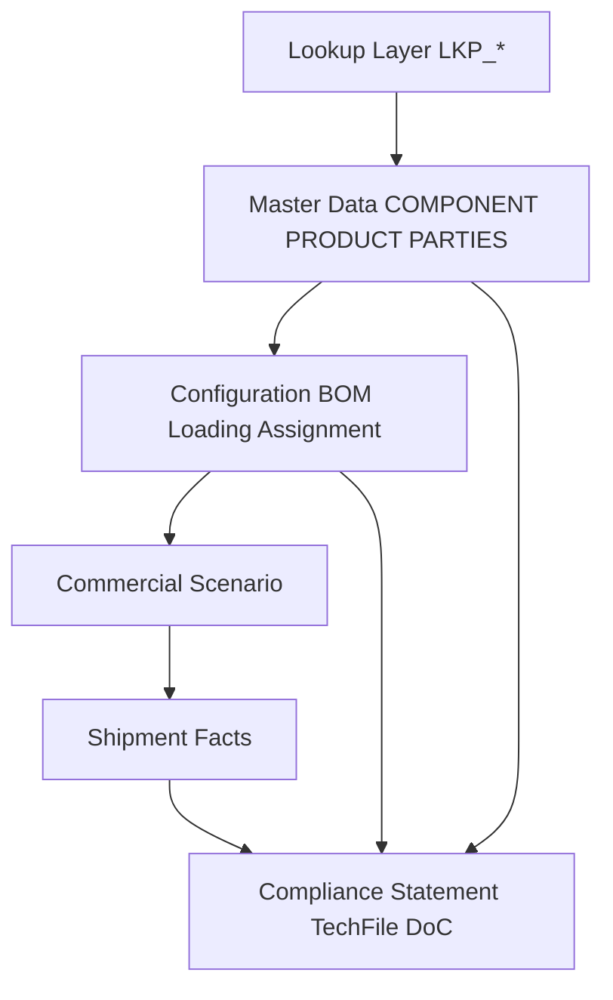
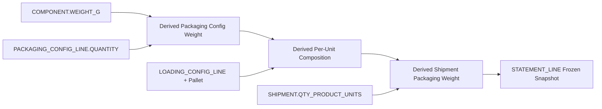

# İnci Akü PPWR Packaging Information Management System (PIMS)
## Software Architecture Plan

| Document | Version | Status | Date |
|----------|---------|--------|------|
| PLAN.md | 0.1.1 | Architecture Complete | 2026-08-02 |

---

## 1. Executive Summary

This project designs a **Packaging Information Management System (PIMS)** for İnci Akü to support compliance with the European Union **Packaging and Packaging Waste Regulation (PPWR)**.

The system is implemented as a **relational database inside Microsoft Excel**: each worksheet is a table, each row is a record, relationships are enforced via primary/foreign keys, and calculated outputs (weights, statements, conformity data) are derived—never duplicated as source facts.

PIMS will become the company’s **core packaging master data system**. Excel is the delivery medium for Phase 1; the data model is designed so it can later migrate to SQL Server / PostgreSQL / SAP without redesigning entities.

---

## 2. Business Context

### 2.1 Regulatory Driver

PPWR requires economic operators placing packaging on the EU market to demonstrate:

- Packaging composition and material identification
- Weight and quantity of packaging placed on the market
- Recycled content and recyclability-related attributes
- Reuse / reusable packaging characteristics where applicable
- Traceable technical documentation
- Declaration of Conformity (DoC) linkage to assessed packaging/products

### 2.2 Business Driver

İnci Akü ships batteries using multi-level packaging (primary / secondary / tertiary). Today, packaging data is typically fragmented across spreadsheets, drawings, and tribal knowledge. That creates:

- Repeated weight entries (risk of inconsistency)
- No single source of truth for configurations
- Difficult aggregation for annual / market statements
- Weak audit trail for Technical File and DoC

PIMS solves this by modeling packaging as **normalized master data + configuration assemblies + shipment facts + compliance snapshots**.

---

## 3. System Objectives

| Objective | Description |
|-----------|-------------|
| Single source of truth | One record per packaging component; weights stored once |
| Configuration management | Bill-of-materials style packaging and loading configurations |
| Product linkage | Products linked to packaging / loading setups without copying component data |
| Commercial scenarios | Customer / market / product packaging variants managed as scenarios |
| Shipment facts | Operational quantities that drive compliance calculations |
| Compliance outputs | Statements, Technical File data, Declaration of Conformity data |
| Auditability | Historical versions, effective dates, approval status |
| Extensibility | Excel Phase 1 → relational DB Phase 2 without conceptual rewrite |

---

## 4. In-Scope Entities (Phase 1)

1. Packaging Components  
2. Packaging Configurations  
3. Loading Configurations  
4. Products  
5. Commercial Scenarios  
6. Shipments  
7. Statements  
8. Technical File Data  
9. Declaration of Conformity Data  

Supporting domains (required for a real system):

- Lookup / reference data (materials, levels, statuses, units, countries, etc.)
- Parties (suppliers, customers, plants, responsible persons)
- Junction / bridge tables for many-to-many relationships
- Audit metadata (created/updated, version, effective dating)

---

## 5. Out of Scope (Phase 1)

- Live ERP / SAP bidirectional sync
- Automated customs filing
- Full LCA / carbon footprint engine
- User authentication / multi-user concurrency server
- Python generators / Excel file creation (deferred to later prompts)
- Mobile apps or web UI

---

## 6. Architectural Principles

### 6.1 Relational Model Inside Excel

| Relational Concept | Excel Implementation |
|--------------------|----------------------|
| Schema / Database | Workbook |
| Table | Dedicated worksheet (one entity per sheet) |
| Row | Record / tuple |
| Column | Attribute / field |
| Primary Key | Unique ID column (`*_ID`) |
| Foreign Key | ID column referencing another sheet |
| Lookup table | `LKP_*` sheet |
| Junction table | `*_LINE` / assignment sheet |
| View / report | Calculated sheet or Power Query / formulas (read-only) |
| Constraint | Data Validation, named ranges, Power Query checks, later VBA/Python validators |

### 6.2 Normalization Rules (Mandatory)

1. **3NF target** for transactional and master data.  
2. **No duplicated component weights** across configs, products, or shipments.  
3. **No repeated packaging BOM lines** as free text; use junction tables.  
4. Every entity has a **surrogate primary key** (`*_ID`) plus, where useful, a **business key** (`*_CODE`).  
5. Many-to-many relationships always use an **explicit junction / line table**.  
6. Calculated values (total packaging weight, units per pallet, statement totals) are **derived**, except where a compliance snapshot must be frozen (Statement lines).  
7. Lookup values are never free-typed in fact tables; they reference `LKP_*` keys.

### 6.3 Weight Ownership Rule (Critical)

> **Weight is owned only by `COMPONENT`.**  
> Packaging Configuration total weight = Σ (Component.Weight × Line.Quantity).  
> Loading Configuration packaging weight = Packaging Config total × loading multiplicity + any loading-only components.  
> Shipment packaging placed on market = Loading/Packaging composition × shipped quantity.  
> Statements aggregate shipment-derived weights (or frozen snapshots thereof).

Any sheet that stores a “total weight” as an editable input field (except Component net packaging weight and Product net product weight) is a design defect.

### 6.4 Effective Dating & Versioning

Master and configuration records use:

- `STATUS_ID` (Draft / Active / Obsolete)
- `EFFECTIVE_FROM` / `EFFECTIVE_TO`
- `VERSION_NO` for configurations and compliance documents

Shipments always reference the configuration IDs used at the time of shipment. Statement lines freeze aggregated results for audit.

---

## 7. High-Level Architecture

```text
┌──────────────────────────────────────────────────────────────────────────┐
│                        REFERENCE / LOOKUP LAYER                          │
│  LKP_MATERIAL | LKP_COMPONENT_TYPE | LKP_PACKAGING_LEVEL | LKP_STATUS   │
│  LKP_UOM | LKP_COUNTRY | LKP_CURRENCY | LKP_TRANSPORT_MODE | …          │
└──────────────────────────────────────────────────────────────────────────┘
                                      │
                                      ▼
┌──────────────────────────────────────────────────────────────────────────┐
│                           MASTER DATA LAYER                              │
│  SUPPLIER | CUSTOMER | PLANT | PERSON | PRODUCT_FAMILY | PRODUCT        │
│  COMPONENT                                                               │
└──────────────────────────────────────────────────────────────────────────┘
                                      │
                                      ▼
┌──────────────────────────────────────────────────────────────────────────┐
│                        CONFIGURATION LAYER                               │
│  PACKAGING_CONFIG ──< PACKAGING_CONFIG_LINE >── COMPONENT               │
│  LOADING_CONFIG   ──< LOADING_CONFIG_LINE  >── COMPONENT / PKG CONFIG   │
│  PRODUCT_PACKAGING_ASSIGNMENT (Product ↔ Packaging/Loading)             │
└──────────────────────────────────────────────────────────────────────────┘
                                      │
                                      ▼
┌──────────────────────────────────────────────────────────────────────────┐
│                     COMMERCIAL & OPERATIONAL LAYER                       │
│  COMMERCIAL_SCENARIO → PRODUCT + LOADING_CONFIG + CUSTOMER + MARKET     │
│  SHIPMENT → SCENARIO (or explicit FKs) + QUANTITY + DATES + DEST        │
└──────────────────────────────────────────────────────────────────────────┘
                                      │
                                      ▼
┌──────────────────────────────────────────────────────────────────────────┐
│                        COMPLIANCE OUTPUT LAYER                           │
│  STATEMENT + STATEMENT_LINE (frozen aggregates)                          │
│  TECHNICAL_FILE (+ links to Component / Packaging Config)                │
│  DECLARATION_OF_CONFORMITY (+ links to Tech File / Product / Config)     │
└──────────────────────────────────────────────────────────────────────────┘
```

### 7.1 Layer Dependency (Mermaid)



### 7.2 Weight Calculation Pipeline



---

## 8. Domain Model Overview

### 8.1 Packaging Component

Atomic packaging item (carton, divider, stretch film, label, strap, pallet, cap, bag, etc.).  
Owns material, level, dimensions, and **unit weight**.

### 8.2 Packaging Configuration

Named assembly of components (BOM) used to pack one product unit or one sales unit.  
Does **not** store total weight as source data.

### 8.3 Loading Configuration

How packed units are loaded for transport (units/layer, layers/pallet, pallet type, tertiary packaging).  
References a Packaging Configuration and optional extra loading-level components.

### 8.4 Product

Battery / SKU master. Stores **product net weight** (battery), not packaging weight.

### 8.5 Commercial Scenario

Commercial packaging variant: which product, for which customer/market, uses which loading configuration, under which commercial terms/validity.

### 8.6 Shipment

Operational fact: quantity shipped under a scenario (or equivalent FKs), on a date, to a destination.  
Drives PPWR “placed on the market” calculations.

### 8.7 Statement

Compliance reporting header (period, market, type, approval).  
Lines store **snapshot aggregates** by material / packaging level (intentional, auditable denormalization at reporting boundary).

### 8.8 Technical File Data

Structured technical documentation attributes and references supporting design-for-recycling / substance / assessment evidence for a component or packaging configuration.

### 8.9 Declaration of Conformity Data

Formal DoC record linking responsible person, scope (product/config), regulation references, validity, and Technical File.

---

## 9. Relationship Strategy

| From | To | Cardinality | Mechanism |
|------|----|-------------|-----------|
| Packaging Config | Component | M:N | `PACKAGING_CONFIG_LINE` |
| Loading Config | Packaging Config | N:1 | `PACKAGING_CONFIG_ID` FK |
| Loading Config | Component | M:N | `LOADING_CONFIG_LINE` (tertiary extras) |
| Product | Packaging / Loading Config | M:N | `PRODUCT_PACKAGING_ASSIGNMENT` |
| Commercial Scenario | Product | N:1 | FK |
| Commercial Scenario | Loading Config | N:1 | FK |
| Commercial Scenario | Customer / Country | N:1 | FKs |
| Shipment | Commercial Scenario | N:1 | FK (preferred) |
| Statement | Statement Line | 1:N | FK |
| Technical File | Component or Packaging Config | N:1 | nullable FKs with XOR rule |
| DoC | Technical File | N:1 | FK |
| DoC | Product and/or Packaging Config | N:1 | FKs |

Full field-level design: see `DATABASE.md`.

---

## 10. Excel Workbook Architecture

### 10.1 Workbook Roles (Logical)

| Workbook / Area | Purpose |
|-----------------|---------|
| `PIMS_Core.xlsx` (target) | All normalized tables + lookups |
| Control sheet | Version, parameters, validation dashboard |
| Dictionary sheet | Data dictionary / field catalog |
| Calc / staging (optional) | Derived views; never source master weights |

Phase 1 may ship as a **single workbook** with strict sheet naming. Multi-workbook split is a later optimization.

### 10.2 Sheet Categories

1. `SYS_*` — system / control  
2. `LKP_*` — lookup tables  
3. Master entity sheets — `COMPONENT`, `PRODUCT`, …  
4. Config sheets — `PACKAGING_CONFIG`, `PACKAGING_CONFIG_LINE`, …  
5. Fact sheets — `SHIPMENT`, `STATEMENT`, …  
6. `VW_*` or `RPT_*` — derived reports (read-only by convention)

### 10.3 Integrity Enforcement (Excel Constraints)

Because Excel is not a full RDBMS engine, integrity is enforced in layers:

1. **Schema conventions** (IDs, naming, one entity per sheet)  
2. **Data Validation** lists sourced from lookup / key columns  
3. **Unique key checks** (conditional formatting / validation sheet)  
4. **Orphan FK checks** (validation queries)  
5. **Business rules** (documented in `DATABASE.md`; automated later)  
6. Future: Python validation suite against exported tables

---

## 11. Calculation Philosophy

| Metric | Source of truth | Storage |
|--------|-----------------|---------|
| Component unit weight | `COMPONENT.WEIGHT_G` | Stored |
| Product net weight | `PRODUCT.NET_WEIGHT_G` | Stored |
| Packaging config weight | Σ component lines | Calculated |
| Loading packaging weight | Config + loading lines × multiplicities | Calculated |
| Shipment packaging weight | Composition × shipped qty | Calculated |
| Statement material totals | Aggregation over shipments in period | Snapshot on `STATEMENT_LINE` |

---

## 12. Delivery Phases

| Phase | Deliverable | Status |
|-------|-------------|--------|
| **A. Architecture** | `PLAN.md`, `DATABASE.md`, `TASKLIST.md`, `NAMING_CONVENTION.md`, `PROJECT_STRUCTURE.md`, `CHANGELOG.md` | **Current — Complete** |
| **B. Data Model Formalization** | Finalize keys, domains, sample reference data specs | Next |
| **C. Excel Workbook Build** | Create sheets, validations, sample seeds | Later |
| **D. Automation** | Python generators / validators / importers | Later |
| **E. Compliance Reporting** | Statement engine, Tech File / DoC packages | Later |
| **F. Enterprise Migration** | SQL/ERP integration blueprint | Future |

---

## 13. Non-Functional Requirements

| Area | Requirement |
|------|-------------|
| Consistency | No conflicting weights for the same component |
| Traceability | Every shipment explainable down to component lines |
| Audit | Statement snapshots immutable after approval |
| Usability | Business-readable codes + surrogate IDs |
| Performance | Suitable for thousands of components and tens of thousands of shipment lines in Excel; migrate if larger |
| Localization | Codes/IDs language-neutral; descriptions may be TR/EN |
| Security (Phase 1) | File-level access control via SharePoint/AD; no secrets in workbook |

---

## 14. Risks & Mitigations

| Risk | Impact | Mitigation |
|------|--------|------------|
| Users type free-text materials | Dirty data | Strict `LKP_*` FKs + validation |
| Copy-paste duplicates components | Weight drift | Business key uniqueness + merge process |
| Storing totals on configs | Dual maintenance | Architecture rule + validation bans |
| Config change after shipment | Historical distortion | Shipments store config IDs; optional config version freeze |
| Excel concurrency | Overwrites | Check-in/out or Phase 2 DB |
| Over-modeling early | Delay | Phase 1 entity set locked to listed domains |

---

## 15. Success Criteria (Architecture Phase)

Architecture phase is complete when:

1. All six markdown documents exist and are consistent.  
2. Every in-scope entity has PK, attributes, and relationships defined.  
3. Weight ownership and calculation chain are unambiguous.  
4. Lookup tables and validation logic are documented.  
5. Naming and folder structure are defined for later build steps.  
6. No Python code and no Excel files have been generated yet.

---

## 16. Related Documents

| File | Content |
|------|---------|
| `DATABASE.md` | Full logical data model, keys, FKs, lookups, validation |
| `TASKLIST.md` | Work breakdown for subsequent phases |
| `NAMING_CONVENTION.md` | Sheets, fields, codes, IDs |
| `PROJECT_STRUCTURE.md` | Repository / artifact layout |
| `CHANGELOG.md` | Version history |

---

## 17. Decision Log (Architecture)

| ID | Decision | Rationale |
|----|----------|-----------|
| D-001 | Excel as Phase 1 RDBMS medium | Business accessibility; model remains relational |
| D-002 | Surrogate `*_ID` + business `*_CODE` | Stable joins + human usability |
| D-003 | Component owns packaging weight | Prevents duplication |
| D-004 | Junction tables for BOM/loading lines | True M:N, normalized |
| D-005 | Commercial Scenario as shipment preferred parent | Encodes customer/market/packaging variant once |
| D-006 | Statement lines are frozen snapshots | Audit/compliance requirement |
| D-007 | Tech File XOR link (Component **or** Packaging Config) | Avoid ambiguous ownership |
| D-008 | No Python / no XLSX in this phase | Architecture-first gate |

---

**STOP GATE:** Architecture documentation only. Implementation awaits next prompt.
